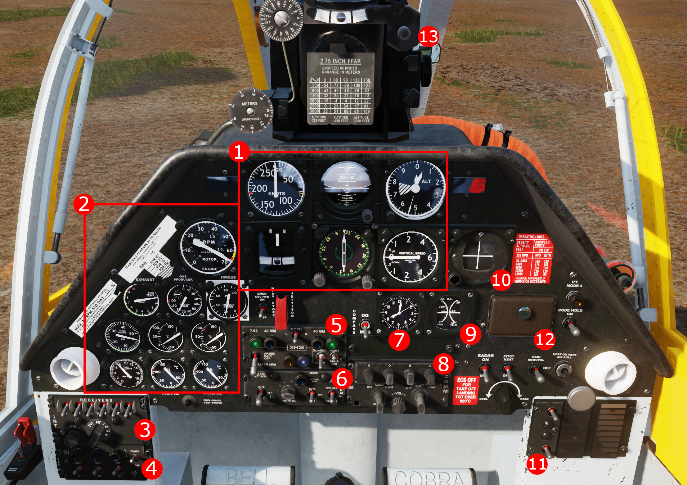

# Pilot Seat Layout

## Overview

### Front Panel

| # | Name | Summary |
| ------ | ---- | ------- |
| 1  | [Six Pack Gauges](#six-pack-gauges) | Standard 6 Pack Gauges |
| 2  | [Engine Gauges](#engine-gauges) | RPMs, Temps, Fuel Quantity etc
| 3  | [Intercom Panel](#intercom-panel) | Audio Configuration |
| 4  | [SAS Panel](#sas-power-panel) | SAS Power and No Go Lights |
| 5  | [Turret Panel](#turret-panel) | Master Arm, Turret Priority, Status Lights |
| 6  | [Armament Panel](#armament-panel) | Jettison Select, Wing Station Select, Rocket Quantity, Smoke Launcher
| 7  | 
| 8  | [AN/ARC-131](../Radios/ARC131.md) | FM Radio, see the radio section.
| 9  | 
| 10 | 
| 11 | 
| 12 | 
| 13 | 

---

### Left Panel

---

### Right Panel

---

## Details

### Front Panel

#### Six Pack Gauges

#### Engine Gauges

#### Intercom Panel

#### SAS Power Panel

#### Turret Panel

#### Armament Panel

#### Clock

#### FM Radio

#### Electrical Gauges

#### Localizer

#### Warning Panel

#### Ashtray

#### Gunsight