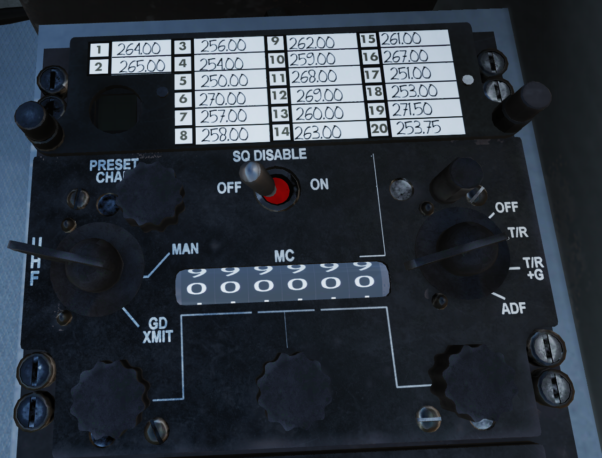

# AN/ARC-51 UHF
## Overview

The AN/ARC-51 UHF radio served as one of the most common military radios throughout the 70s. It operates with AM in the 225-400 MHz military communications band.  
A seperate guard reciever on 243.0 MHz was also fitted, allowing the user to quickly monitor and transmit on guard.

!!! Warning
    TODO update image, caption, add number annotations

## Switches

### 1: Preset Frequency Card
Your preset frequencies are listed on the frequency card, 1 through 20. With the Radio in preset mode, the number seen in the window in the bottom left displays the currently selected frequency.

!!! Note
    The presets cannot be set in the helicopter, and must be set in the mission editor, since the ground crew did the adjusting in real life.

### 2: Preset Selector Knob
Knob used to select preset frequencies 1 through 20, only has any effect when the [Transmit Mode Knob](#3-transmit-mode-knob) is set to "PRESET".

### 3: Transmit Mode Knob
Knob used to adjust the frequency source. Three positions:

| Position | Function |
| -------- | -------- |
| PRESET   | Frequency is sourced from the [Preset Selector Knob](#2-preset-selector-knob) |
| MAN      | Frequency is sourced manually [Frequency Tuning Knobs](TODO ADD LINK) |
| GD XMIT  | Pressing the PTT button with the [UHF selected](Intercom.md) will transmit on guard, regardless of selected frequency |

!!! Warning
    TODO Fix above links in table, intercom needs a header to point to

### 4: Squelch Switch
TODO get a good description of squelch from doogie

### 5: UHF Volume Knob