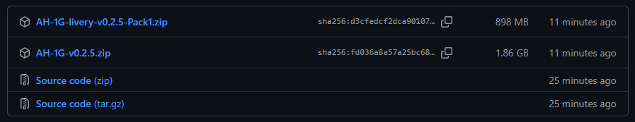

# Installation Guide

Please follow this guide step by step, without taking shortcuts, as files need to be installed in specific places.

!!! Note
    This guide was done on windows 11, so some of the features for extracting zips I use here *might* not be in windows 10 or below. However the instructions still apply for the install.

---

## Download

!!! Warning
    Add the download link when its release time (TODO)  
    *Don't think you guys could pull a fast one on me that easy*

The AH-1G cobra can be installed from ***insert link here***.

On the download site, you will see potentially 2 or more zip files, depending on how many livery packs are available, at the bottom of the new version changelog

Download the `AH-1G-vX.X.X.zip` file, and the livery packs as desired.

!!! Note
    Livery packs may not need to be downloaded every patch, please check the changelog to see if its necessary.

---

## Updating

To update to a new version and prevent any potential issues, please uninstall any previous versions.

Navigate to your `Saved Games/DCS/mods/aircraft` and delete the AH-1G folder, then navigate to the `Saved Games/DCS/mods/tech` folder and remove the `AH-1G_Weaponspack` folder.

Repeat steps in [Download](#download) and [Installation](#installation)

!!! Note
    Liveries are installed seperately, in the `Saved Games/DCS/Liveries/` folder, there are seperate folders for the AH1G, O-1E, and the UH-1C. You will not need to delete these files before overwriting.

---

## Installation

You should now have at least 2 zip files in your downloads.

Select a zip file, click the `Extract All` Button

In the resulting popup menu, click browse, then navigate to your Saved Games/DCS (or DCS.OpenBeta) folder.

Click `Extract`

!!! Warning
    Only Navigate to the DCS folder. Do **NOT** enter a sub folder like mods or liveries, because the files will install in the wrong place

Wait for the extraction to complete, then repeat the above steps for any remaining zip files that need to be installed.

---

## Verify Installation

To verify the mod has been installed correctly, when you load DCS to the main menu, in the bottom left you should see the icon for the AH-1G cobra, with our logo, and the version number you downloaded. If the weapon pack fails to install if you installed incorrectly you will recieve a printed error in the top right of the screen when you load in game, and no weapons will be available to you in the rearm screen / mission editor.