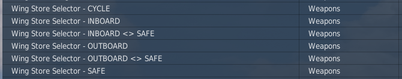
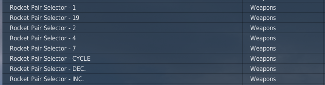

# Keybinds

The AH-1G mod features support for every possible input type for each input.  
The examples below show how to bind the keybinds depending on your required input method. 
!!! Note 
    *Each table lists the options, you only need to bind one row, depending on your setup.*

---

## 2 Position Switch Example

| Options | Binds | Description |
| -- | -- | -- |
| **Toggle** | 1 | Cycles between on and off every time key is pressed |
| **ARM** or **SAFE** | 2 | Specific position keybinds, these do not toggle |
| **SAFE<>ARM** | 1 | Armed else safe, perfect for a 2 position latching switch. |

---

## 3 Position Switch Example

| Options | Binds | Description |
| -- | -- | -- |
| **Cycle** | 1 | Cycles between each position every time key is pressed |
| **IN**/**OUTBOARD** or **SAFE** | 3 | Non Toggle Position Keybinds |
| **IN**/**OUTBOARD<>SAFE** | 1 | IN/OUTBOARD else safe, perfect for a 3 pos latching switch |

---

## Multi Position Switch Example

| Options | Binds | Description |
| -- | -- | -- |
| **Cycle** | 1 | Cycles between each position every time key is pressed |
| **INC**/**DEC** | 2 | Increases or decreases value of switch. |
| **1**/**2**/**4**/**7**/**19** | 5 | Non Toggle Position Keybinds |

---

# Need Something Custom?
Ping `@Hayds_93` in our [discord](/support/#discord-server) if your setup isn't standard, or if theres any trouble interfacing with various tools such as DCS BIOS.