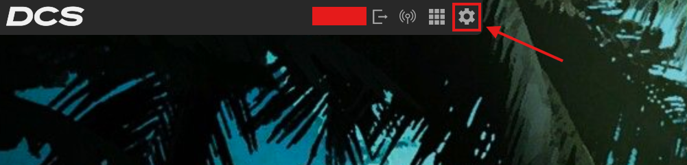
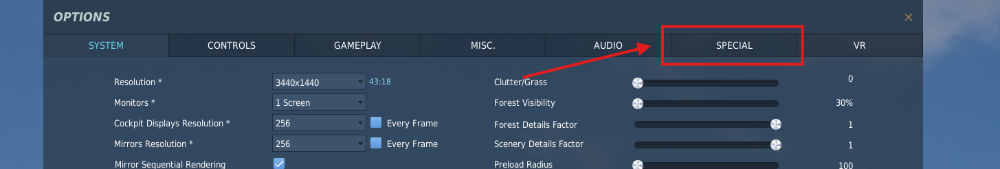
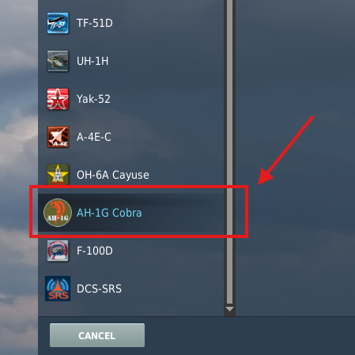
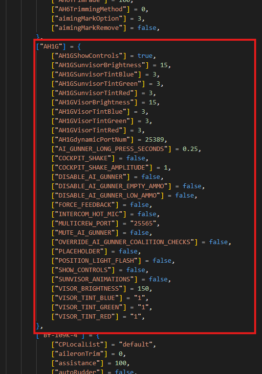

# Special Options

## Menus

The special options menu can be found by clicking on the settings button on the top left corner of the main menu.

Then selecting "SPECIAL" on to top menu bar.

Scroll down and select "AH-1G Cobra". You will be presented with all the customization options.

---

## General Options

### Controls Indicator

The "Show Controls Indicator by default" checkbox enables or disables the controls indicator state on each start up. This can be enabled or disabled at any time using `R CTRL + ENTER` regardless of the state of this option.

---

### Cockpit Shake

The "Cockpit Shake Amplitude" slider scales the amount of shaking the helicopter does. When the slider is set to 1, you will get the realistic amount of shaking, when set to 0, you will get no shaking. Any values in the middle will decrease the amount of shake.

---

### Intercom Hot Mic

The "Enable Intercom Hot Mic" checkbox changes the behaviour of the intercom. In the real cobra, there is no hot mic, the intercom is PTT only via the "Coolie Hat" on the stick. Enabling this option overrides this behaviour.

Works for SRS and in game VOIP.

!!! Warning
    If you have a low quality mic, or bad background noise, for the sake of your other crewman leave this option disabled.

---

### Force Feedback

***Currently INOP***

!!! Warning 
    TODO

---

## AI Gunner Options

### Disable Gunner

Completly disable the AI Gunner, this can potentially improve performance if you are having trouble, or just if you don't want to use it.

!!! Note
    The same effect can be acheived by always leaving the [Turret Owner Switch](../Cockpit/Pilot.md#turret-priority-switch) in the "PILOT" position.

    The Gunner is disabled when a second player is in the CPG seat automatically.
---

### Mute Gunner

Mute the AI Gunner voice lines.

TODO add subititles or something

!!! Note
    This can be done temporarily in the cockpit by disabling the monitor intercom switch on the [Intercom Panel](../Radios/Intercom.md) 
    
    TODO refine link when intercom done, check feature implemented also

---

### Friendly Fire Override

Disable Doug's moral compass. Allows targetting of your own coalition.

!!! Warning
    Destroying friendly units will reset your singleplayer awards, and may incur bans or other penalties on multiplayer servers.

    Our tester "Charger" asked for this, blame him

---

### Disable Low Callouts

Disables Doug calling out when there are 2 rockets left in the selected pods.

---

### Disable Empty Callouts

Disable Doug calling out when the selected pods are empty.

---

### Menu Button Time

Slider to adjust the amount of time the AI Gunner keybinds need to be held to access the long press functions.

---

## Accessory Options

### Sunvisor

#### Sunvisor Tint

The colour of the sunvisor is adjustable via RGB values, 0-255. You can pick a colour [here](https://rgbcolorpicker.com/){:target=blank}.

---

#### Sunvisor Brightness

Slider to adjust the brightness of the visor, 0-255, larger values are darker.

---

#### Disable Animated Sunvisors

If this option is enabled, the sunvisors will always be down by default in the external model. If disabled they will be synced with the state of your sunvisor overlay in the cockpit.

---

## Resetting Special Options

If for whatever reason you need to reset your special options to default, navigate to `Saved Games/DCS/Config/options.lua` and delete the entry for `"AH1G"`.

*Delete every line in the read box, starting at `["AH1G"] = {` and ending at `},`.* 

DCS Will regenerate the options with default values at the next load.

---
