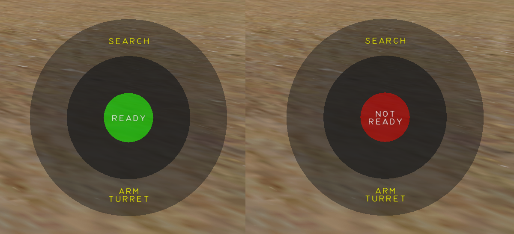
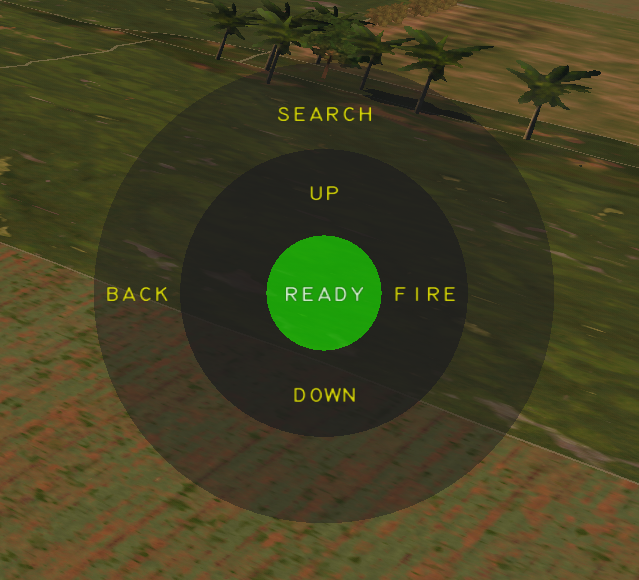

# AI Gunner

## Doug
We have named our gunner Doug, after our voice actor and SME "Doogie". Doogie has had a distinguished US Navy Rotary Wing career, now flying Hueys in a SAR role in the civilian world (see his [YouTube](https://www.youtube.com/@DoogiesRotorReview){:target="_blank"} for some awesome content). On the side, Doogie flies an S model Cobra for a musuem, and his feedback has been valuable in validation functionality and performance.

---

## Keybinds
The AI Gunner needs 4 keybinds, this works best on a 4-way HAT switch on a HOTAS. These keys will be used to navigate the menu, select targets, and perform various actions.

Pressing these keys in the direction shown by the [menus](#menus) will perform that action.

The time required to activate a long press can be adjusted in the [special options](../Setup/SpecialOptions.md#menu-button-time).

---

## Activation
The AI Gunner is enabled any time the pilot seat is occupied, and the front seat does not have a second player.

The Gunner Menus are only visible when the gunner has control of the turret. This can be done via the [Turret Priority Switch](../Cockpit/Pilot.md#turret-priority-switch) in the UP position.

!!! Warning
    Ensure the gunner is not disabled in [special options](../Setup/SpecialOptions.md#disable-gunner). It is enabled by default.

---

## Menus

The Pie menu on the right hand side of the screen is an indicator of what each [button press](#keybinds) will do.

### Main Menu

* A `long press up` will perform a [Target Search](#target-search)
* A `long press down` will configure the turret arming / power switches in the front seat.

---

### Search Menu

#### Pie Menu

When a successful target search happens, the pie menu swaps to the search menu.

* A `long press left` will return to the [Main Menu](#main-menu)
* A `long press up` will preform a fresh search
* A `short press up` or down will scroll up or down in the [Target Selection Window](#target-selection-window)
* A `short press right` will engage the selected target

#### Target Selection Window

When a target search is successful, and targets are found, a window will pop up in the bottom left corner, with a target list, sorted in order by distance.

Friendly Units are in Blue, hostiles in Red, and neutral / Non combative units will be in White.

---

## Target Search

When conducting a target search, the gunner will look for targets +/- 25 degrees of azimuth either side of the pilots head direction at the moment the search is initiated, out to a range of 5000 meters. Line of sight is accounted for, so if you can't see them on your screen, its likely that the gunner won't see them either.

!!! Warning
    TODO these numbers are likely to change, update them at release to be accurate

    This is currently version 1, and lots will be changed and improved, please give me lots of feedback
