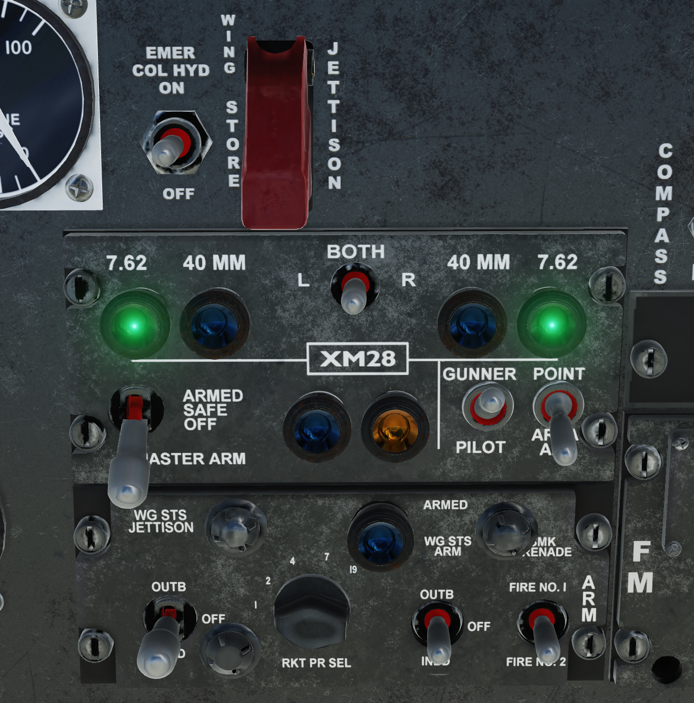
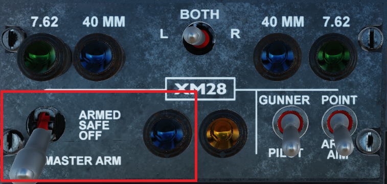
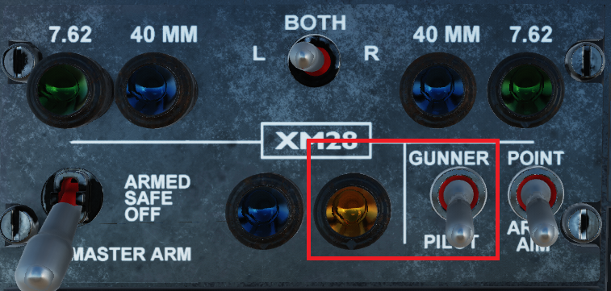
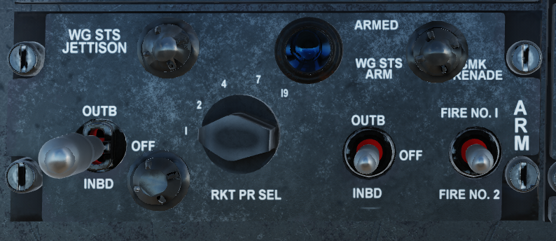
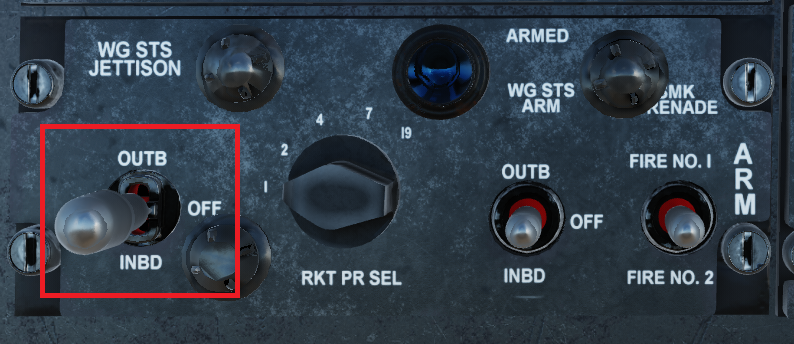
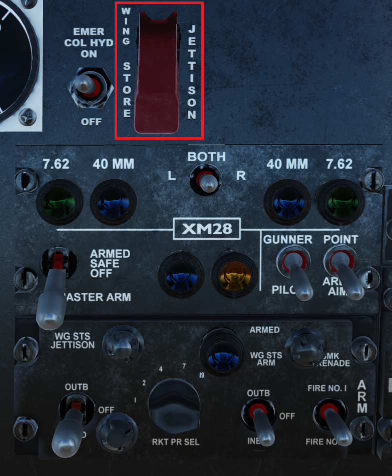
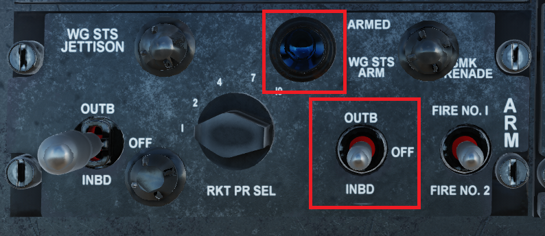
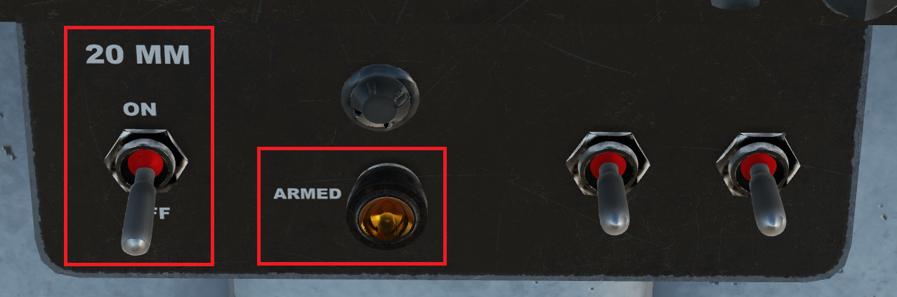

# Configuring Switches

The armament panels can be found at the bottom of the front panel. Outlined in red below.

The Weapons System consists of two panels. The top panel controls the XM28 gun turret as well as master arm, and the bottom panel controls the wing stations. A third panel appears behind the stick if the XM35 is equipped on the left inboard station.

---

## Turret Control / Master Arm Panel
The Turret Control / Master Arm Panel contains useful switches and indicator lights that will be used

---

### Master Arm Switch

  

The Master Arm Switch serves as the main inhibitor switch for all weapons. The down position is safe, the up position is armed. The armed state will be shown by both the switch position, and a blue indicator to the right of the Switch, that will be illuminated when the System is armed, and electrical power is on.

---

### Turret Priority Switch

!!! Warning
    TODO Add the logic for what happens when set to gunner

If the Switch is in the down position, the turret moves to a locked forward position, lined up with the pilots gunsight. If the pilot has command of the turret, the orange light will be illuminated if electrical power is on.

---

### XM28 Turret Controls

The top row of the Turret Control Panel consists of 1 switch, and 4 indicator lights

!!! Note
    These switches are only relevant when the XM28 Turret is equipped.

The indicator lights represent what weapons are equipped to the XM28 Turret. The green 7.62 lights reflect having the M134 cannon equipped on the relative side. The Blue 40mm lights represent having the M129 Grenade Launcher equipped on the relative side.

The center switch toggles either the Left, Right or both depending on position, use this switch in conjunction to the indicator lights. especially in situations where different turret types are equipped.

---

## Wing Station Panel

The Wing Station Panel controls wing mounted weapons, including firing logic such as salvos, as well as jettison selection. Also included, but not pictured here is the Jettison switch, which is under the red cover above the XM28 Turret Controls

---

### Jettison Side Selection

This switch selects which stations are to be jettisoned. The middle position is off/safe, the Up position is the outboard pylons, and the Down position is the inboard pylons.

!!! Note
    The XM35 minigun on the Left Inboard Station Cannot be jettisoned, but the Inboard Right Station will be jettisoned.

---

### Jettison Switch

The Jettison Switch will jettison the selected stations if held for 5 seconds. if the [Jettison Side Selection Switch](#jettison-side-selection) is in the off position, this switch has no effect.

!!! Note
    If the Jettison Keybind is pressed, it is not necessary to lift the cover. Using the mouse to click the switch will require the cover to be lifted.

---

### Rocket Salvo Selection

The Rocket Salvo Knob selects how many fire pulses are sent when the pilot presses the rocket fire button.  
The available options are 1, 2, 4, 7, 19. The salvo interval is 0.167 seconds.

---

### Wing Station Arming

The Wing Station Arm Switch selects which stations will be fired, when the associated release impulse is triggered.  
The middle position is off/safe, the Up position is the outboard pylons, and the Down position is the inboard pylons.

If The [Master Arm Switch](#master-arm-switch) is armed, and the Wing Station Switch is set to either inboard or outboard, the Wing Station Arm light will illuminate to indicate if the system is armed.

---

## 20MM Panel

This panel is sits at the bottom of the middle of the dash. It is only enabled when the XM35 minigun is installed on the Inboard Left Station.

---

### 20MM Arm Switch

The 20MM Arm Switch is required to be Armed to fire the XM35 Minigun. If the [Master Arm Switch](#master-arm-switch) is set to arm and the [Wing Station Arm](#wing-station-arming) is set to inboard, the orange Armed indicator will illuminate.

---

