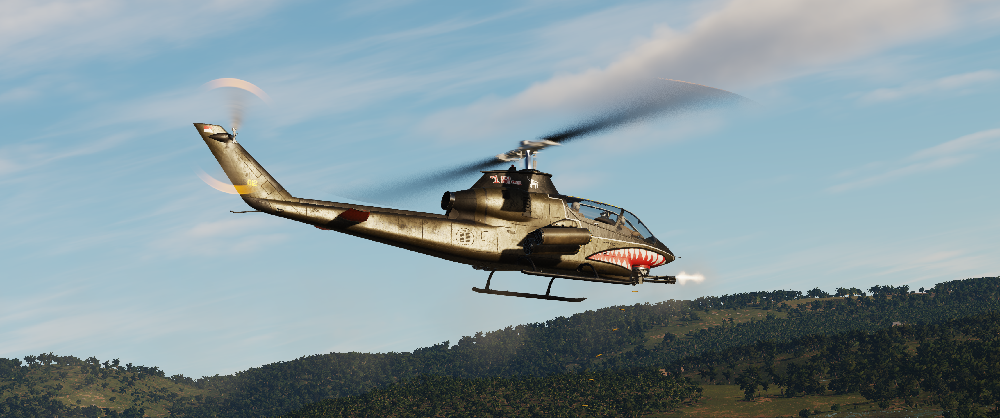

# AH-1G Weapon Systems Overview

The AH-1G carries a variety of weapons, to perform COIN, CAS, or a selection of other missions. Selecting the right loadouts for your targets will assist mission success.

*An AH-1G loaded with the XM197 20mm Turret and 4x XM159 17lb FFAR Rocket Pods*
---

## Wing Pylons
The AH-1G has 4 wing mounted pylons, 2 on each side, labelled here as `OUT L`, `IN L`, `OUT R`, `IN R`

| Name | Type | Station | Variants |
| -----| --------| ---- | ---------|
| XM157 | Rocket Pod (x7) | OUT L/R, IN L/R | 6lbs, 10lbs, 17lbs Warheads |
| XM158 | Rocket Pod (x7) | OUT L/R, IN L/R | 6lbs, 10lbs, 17lbs Warheads |
| XM159 | Rocket Pod (x19) | OUT L/R, IN L/R | 6lbs, 10lbs, 17lbs Warheads |
| XM18 | Gun Pod (x1500)| IN L/R | 7.62 Gunpod |
| XM35 | Gun Pod (x1000)| IN L | 20MM Minigun |

---

## Turrets

Our cobra reproduction features several Turret options, including a mix of regular service weapons, and some test loadouts.

### XM28 Turret

The XM28 is capable of housing 2 weapons, with 2 options per slot. This Turret is the standard issue on the G model Cobra.

*XM28 Turret equipped with 2x M134 7.62 Miniguns*

The available options are as follows:  

| Name | Type | notes |
| -----| -------- | ---------|
| M134 | 7.62mm Minigun | Compatible with XM28 turret, up to 2 available |
| M129 | 40mm Grenade Launcher | Compatible with XM28 turret, up to 2 available |

---

### XM195 Turret

The XM195 is a 20x102mm 6 barrel minigun, housing 950 rounds.

*AH-1G equipped with an XM195 turret straffing ground targets*

---

### XM197 Turret

The XM197 is a 20x102mm 3 barrel minigun, housing 950 rounds.

*AH-1G equipped with an XM197 turret straffing ground targets*

---

### GE430

The GE430 shoots 80x173mm rounds, with a capacity of 80 rounds.

*GE430 equipped Cobra breaks away from the camera ship*

---

