# ATTACK HELICOPTER AND AEROSCOUT COMBAT OPERATIONS

## 1\. Fundamental Aviation Doctrine &amp; Operational Paradigm

### Context &amp; Strategic Importance

In modern high-intensity maneuver warfare, airborne anti-armor capabilities fundamentally alter ground dynamics. Modern attack helicopter units operate as apex predators on the battlefield, leveraging three-dimensional tactical movement to disrupt, neutralize, and destroy massed armored threat formations. As established in FM 17-50, Chapter 4, rotary-wing attack operations do not merely support the ground scheme of maneuver; they provide an independent, highly lethal instrument capable of projecting concentrated combat power across the operational depth of the Forward Edge of the Battle Area (FEBA). By integrating Nap-of-the-Earth (NOE) flight profiles with high-precision standoff weaponry, attack aviation strips the adversary of operational momentum, shapes the engagement area (EA), and secures decisive advantages for friendly ground maneuver elements.

### The Four Core Tactical Imperatives: The Sequential Tactical Kill Chain

Achieving total anti-armor battlefield dominance requires absolute adherence to four core tactical imperatives. Rather than operating as isolated functions, these elements form a sequential tactical kill chain designed to systematically identify, fix, and eradicate threat armor formations:

1. **SEE:** Gain superior battlefield awareness relative to the enemy to secure the initial operational advantage. Forces must locate, identify, and track threat compositions, avenues of approach, and force dispositions before adversary sensors detect friendly elements.
2. **CONCENTRATE:** Utilize extreme operational mobility to mass sufficient tank-killing combat power at the decisive point and time. Rotary-wing assets aggregate firepower at vulnerable threat sectors faster than enemy reaction cycles allow.
3. **SUPPRESS:** Utilize field artillery and tactical fighter bombers to neutralize enemy air defenses (SEAD) and enable battlefield movement. Suppressing threat surface-to-air systems opens low-altitude movement corridors, securing the freedom of maneuver necessary for attack elements to occupy tactical positions.
4. **DESTROY:** Eradicate sufficient numbers of the enemy to break their attack momentum or force them from vital terrain. Terminal ordnance delivery must decisively shatter enemy armor cohesion and deny key terrain objectives.

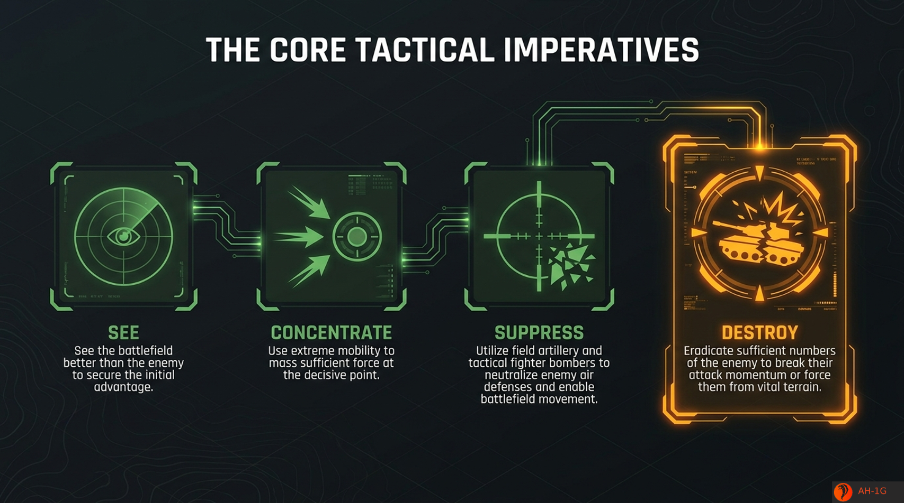

### The Attack Helicopter Operational Paradigm

Rotary-wing attack operations are governed by four foundational analytical pillars that dictate how combat power is concentrated, executed, and sustained on the battlefield:

* **Mobility:** Move faster than the enemy can react; concentrate combat power at the decisive place and time. Attack helicopter units exploit high transit speeds to maneuver across divisional boundaries, rapidly aggregating massed anti-armor fires against exposed threat flanks.
* **Firepower:** Maximize stand-off range; strictly prioritize moving armor and avoid dug-in infantry. Weapon delivery systems exploit standoff capabilities up to 4.2 km at operating engagement altitudes between 50 and 150 ft Above Ground Level (AGL). Ordnance is reserved exclusively for high-value mobile armor assets rather than entrenched infantry.
* **Terrain:** The earth is your primary armor. Never fight exposed; utilize NOE (nap-of-the-earth) and contour flight to remain masked. Flight crews treat topographical features, vegetation canopies, and ridgelines as physical shielding, remaining fully masked from adversary optical and radar tracking until the precise moment of unmasking.
* **Endurance:** Apply the One-Third rule to guarantee the enemy faces continuous, unbroken pressure. Commanders structure force rotations to maintain relentless anti-tank fire superiority without incurring unit culmination or logistical exhaustion.

### The Hunter's Creed

&gt; "TAILOR MOVEMENT TO THE TERRAIN. USE SUPPRESSIVE FIRES. KNOW THE ENEMY. MAXIMIZE CAPABILITIES WHILE MINIMIZING VULNERABILITY."

Having established the fundamental operational paradigm and sequential kill chain governing attack aviation, doctrinal analysis must address the structural division of labor required to execute these missions in high-threat operational environments.

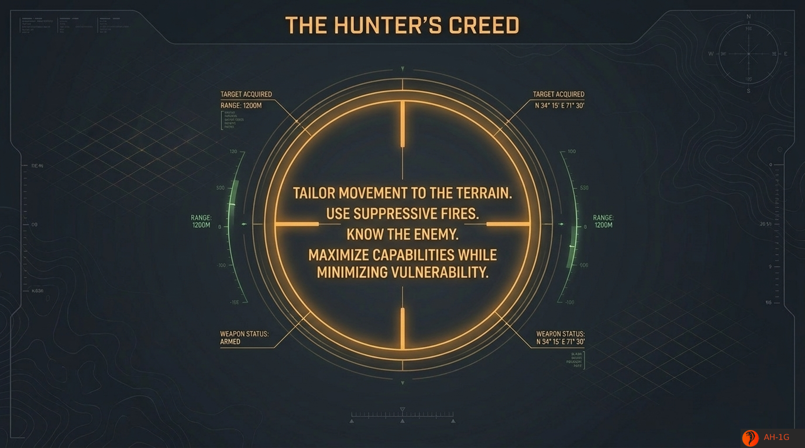

---

## 2\. Tactical Division of Labor: Aeroscout vs. Attack Helicopter

### Context &amp; Strategic Importance

The combat survivability and lethal efficiency of rotary-wing attack operations depend on decoupling forward reconnaissance from heavy weapons delivery. Pairing an agile, highly observant scout element ("The Hound") with a heavily armed strike platform ("The Hunter") establishes essential tactical synergy. Decoupling scouting from fire delivery prevents heavy attack aircraft from exposing their signatures while seeking targets, enabling aeroscouts to develop the tactical situation while attack elements remain concealed in masked holding areas until terminal commitment.

### Comparative Role Analysis

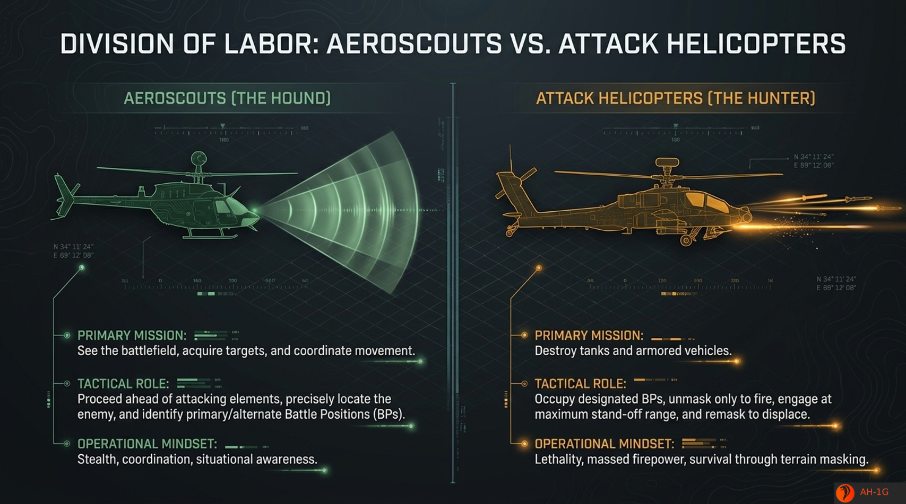

### Interoperability &amp; Coordination Dynamics

The operational workflow between Aeroscouts and Attack Helicopters follows a synchronized tactical sequence. Aeroscouts advance forward of the main attack force along designated movement axes, performing low-altitude reconnaissance to detect threat main bodies and map air defense envelopes. Upon identifying enemy armor columns, the Aeroscout analyzes surrounding terrain to select and designate primary, alternate, and supplementary Battle Positions (BPs) that afford optimal standoff firing geometry and masking options.

During forward target acquisition, Attack Helicopters remain masked in rearward Holding Areas (HAs) with engines turned over or at flight idle to minimize thermal and acoustic signatures. Upon verifying target coordinates and BP suitability, the Aeroscout transmits target handoff data via digital link or voice protocols. Attack helicopters then advance via covered NOE routes to occupy primary BPs, unmasking briefly to deliver standoff anti-armor ordnance before remasking immediately to displace, leaving the threat force unable to acquire or return fire.

Establishing functional division of labor provides the structural framework for executing terminal anti-armor engagements down to the individual firing sequence.

---

## 3\. Mechanics of the Kill: The Six-Stage Engagement Sequence

### Context &amp; Strategic Importance

The terminal phase of an anti-armor engagement demands precise execution. Standardizing the terminal sequence into a strict six-stage kill protocol minimizes aircraft vulnerability, optimizes weapon system kinematics, and ensures aircrews exploit maximum standoff range to destroy enemy armor while denying threat air defense systems an active tracking loop.

### The Six-Stage Engagement Sequence

1. **MOVE:** Proceed to a concealed holding area via covered, low-altitude tactical flight profiles along terrain masking corridors.
2. **COORDINATE:** Receive target data and battle position from the Aeroscout, including threat grid coordinates, target composition, and terrain orientation.
3. **OCCUPY:** Move to the designated Battle Position (BP) under complete terrain masking, establishing proper aircraft orientation toward the engagement area.
4. **ACQUIRE:** Partially unmask to gain line-of-sight and acquire the target, utilizing sight sensors or millimeter-wave radar to establish target tracking locks.
5. **STRIKE:** Unmask fully as required to fire at maximum stand-off range, launching anti-armor ordnance while maintaining system tracking until terminal impact or flight lock transfer.
6. **DISPLACE:** Remask immediately, then move to an alternate firing position or return to the holding area to prevent threat artillery counter-fire or air defense tracking.

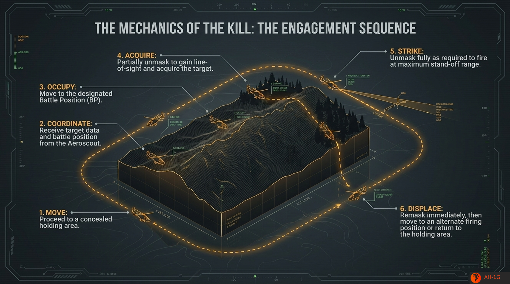

### Flight Profiles, Altitude Management, and Tactical Aerodynamics

Surviving modern integrated air defense systems (IADS) requires absolute mastery of low-altitude flight profiles and aerodynamic unmasking controls:

* **Nap-of-the-Earth (NOE):** Flight conducted as close to the earth's surface as vegetation, terrain, and obstacle clearance permit. Aircraft conform strictly to the micro-relief of the earth, utilizing tree lines, gullies, and depressions to deny enemy visual and optical acquisition.
* **Contour Flight:** Low-altitude flight conforming generally to the broader contours of the terrain at low airspeeds. Utilized in areas of reduced threat density or during rapid transit between holding areas.
* **Low-Level Flight:** Flight conducted at a constant altitude and airspeed along a pre-selected route. Restricted to rear areas where thread envelopes are negated.

During tactical unmasking, aircrews execute precise collective and pitch management. From a masked hover at 50 ft AGL behind terrain masking features, the pilot applies vertical collective to unmask the aircraft sensor suite (partial unmask) to acquire optical or radar line-of-sight. Once target tracking is locked, the pilot executes a rapid vertical pop-up maneuver to 150 ft AGL (full unmask firing window) to launch standoff missiles at ranges up to 4.2 km.

Minimizing duration in the 150 ft AGL window to under the threat's radar acquisition loop (typically less than 7–10 seconds) prevents threat surface-to-air missile (SAM) systems from completing engagement cycles. Upon missile launch or impact, collective is dropped immediately to remask the aircraft back to 50 ft AGL prior to displacing laterally to an alternate Battle Position.

Mastery of individual engagement mechanics enables aviation commanders to integrate attack helicopter forces into operational phase-based profiles across dynamic maneuver campaigns.

---

## 4\. Phase-Based Operational Profiles and Target Prioritization

### Context &amp; Strategic Importance

Flight profiles and target selection criteria are dynamic variables that must adapt to the overarching operational phase of battle. Synchronizing flight profiles and targeting hierarchies with mission phases ensures attack helicopter battalions operate safely behind air cavalry screens during movement to contact, mass combat power during offensive attacks, and maintain unrelenting encirclement during pursuit operations.

### Three-Phase Mission Execution Profiles

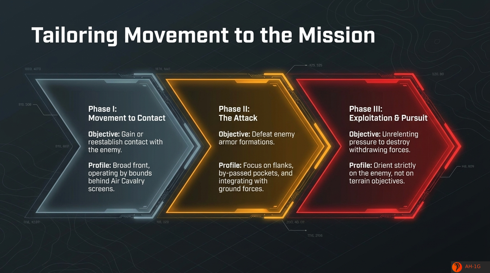

#### Phase I: Movement to Contact ("Finding the Seam")

* **Objective:** Gain or reestablish contact with the enemy main body.
* **Operational Structure:** Operates on a broad front structured across three functional tiers:
  * *The Vanguard:* Air Cavalry elements conduct zone reconnaissance on a broad front ahead of the main task force to locate threat axes and map air defense coverage.
  * *The Main Body:* Ground maneuver elements advance along central routes, held in readiness to react to contact.
  * *The Hunter Force:* Attack helicopter units move by bounds behind the Air Cavalry zone reconnaissance.
* **Tactical Logic:** The Hunter Force is held ready to react to avoid early detection, remaining poised to mass tank-killing power the moment the enemy main effort or exposed structural seams are identified.

#### Phase II: The Attack (Anti-Armor Dominance)

* **Objective:** Defeat enemy armor formations.
* **Profile Integration:** Focus on striking exposed target flanks, eliminating bypassed threat pockets, and integrating closely with ground maneuver schemes.
* **Target Profile Evaluation:**
  * *Optimal Target Profile:* Attack helicopters are best suited for attacking enemy armor formations on the move. Aircrews utilize maximum stand-off range to exploit exposed flanks and penetrations, providing immediate anti-armor firepower to blunt counterattacks.
  * *Sub-Optimal / Invalid Target Profile:* Attack helicopters are least effective attacking strongly fortified, dug-in defensive positions. Attack helicopters lack the staying power required to attack, secure, and hold terrain against entrenched ground forces.

#### Phase III: Exploitation &amp; Pursuit ("Unrelenting Pressure")

* **Objective:** Apply unrelenting pressure to destroy withdrawing forces and prevent the enemy from reorganizing a defense.
* **Maneuver Geometry &amp; The Dual-Force Rule:**
  * *Direct Pressure Force:* Ground forces orient on terrain objectives and avenues of retreat, advancing linearly along primary terrain axes to maintain direct contact with retreating rear elements.
  * *Encircling Force:* Attack Helicopters orient directly on the enemy, executing a wide sweeping flank arc around the retreating enemy column to seal off retreat corridors while avoiding and not fighting the enemy rear guard.
* **The Tactical Rule:** Attack withdrawing main bodies, but avoid and do not fight the enemy rear guard. Striking rear guards consumes ordnance on non-decisive targets, allowing the threat main body to escape.

### High-Value Target Prioritization Pyramid

To achieve the **systematic degradation of the enemy's operational capability**, attack helicopter crews follow a strict 5-tier targeting hierarchy. Targeting prioritizes mobile assets that sustain threat momentum before addressing static operational bottlenecks:

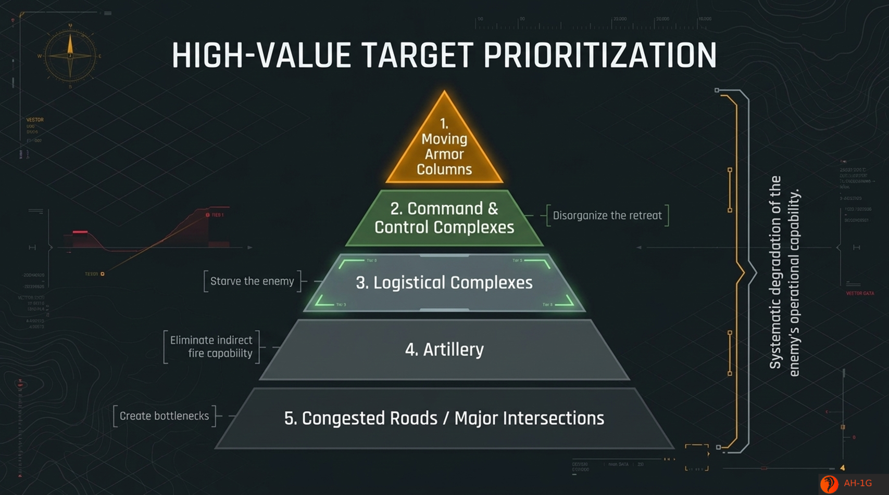

1. **Moving Armor Columns (Tier 1 - Highest Priority):** Represents the primary threat to friendly operational cohesion. Striking mobile armor halts the enemy's main offensive effort immediately.
2. **Command &amp; Control Complexes (Tier 2):** Targeted to disorganize the retreat or collapse threat operational command structure.
3. **Logistical Complexes (Tier 3):** Targeted to starve the enemy of fuel, ammunition, and operational sustainment.
4. **Artillery (Tier 4):** Targeted to eliminate indirect fire capability, protecting friendly ground forces from counter-battery and suppressive fires.
5. **Congested Roads / Major Intersections (Tier 5):** Targeted to create operational bottlenecks and delay threat repositioning.

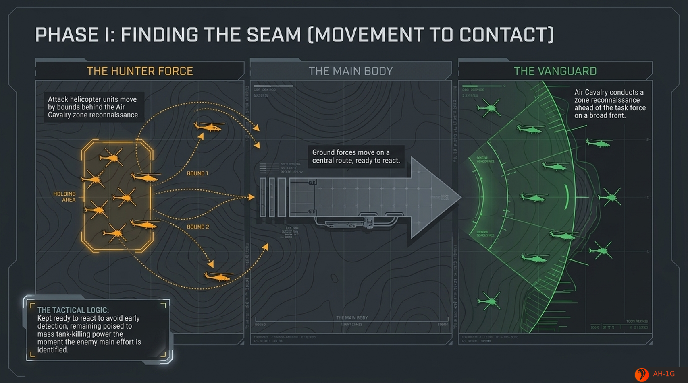

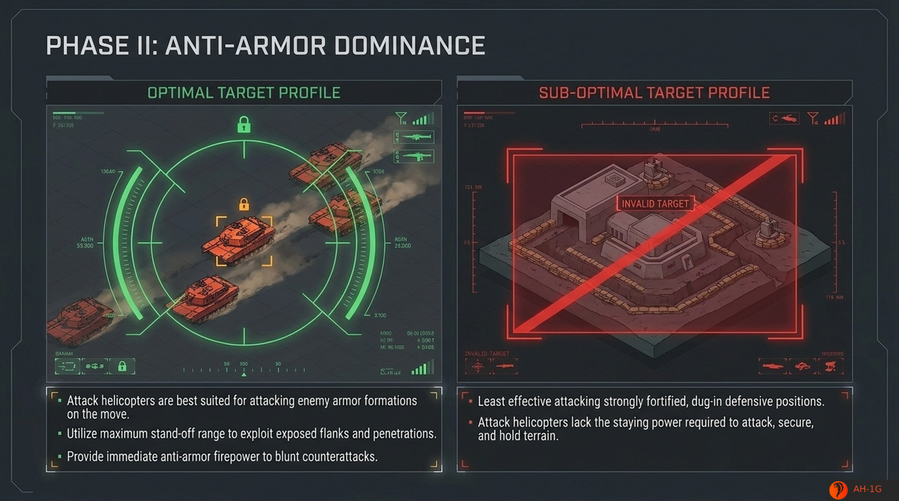

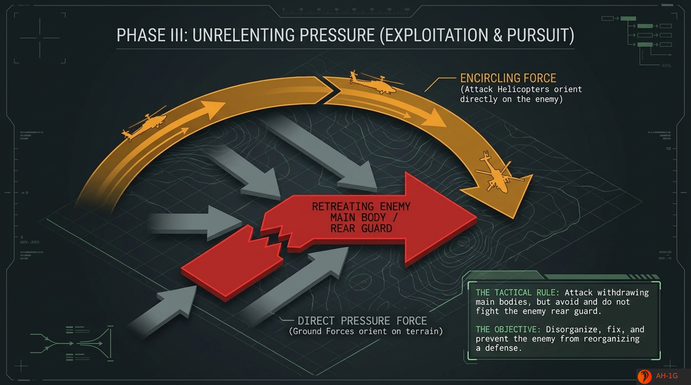

Understanding phase-based offensive operations provides the doctrine required to employ attack aviation in defensive force integration roles.

---

## 5\. Defensive Applications and Force Integration

### Context &amp; Strategic Importance

Although rotary-wing attack units are inherently offensive weapon systems, integrating their speed and firepower into defensive ground schemes provides commanders with an agile antitank reserve. In defensive operations, attack helicopters exploit the defender's tactical position to blunt enemy initiative, strip away armor support, and stop deep battlefield penetrations.

### Blunting Enemy Initiative

In the defense, the friendly force possesses significant operational advantages: time to study terrain, analyze enemy avenues of approach, and select optimal, concealed firing positions. Attack helicopters are offensive in nature, but in defense, they prevent the enemy from controlling vital terrain. To achieve this, attack helicopter units must be committed in large numbers, in the same general area, in rotation, to provide continuous antitank fires that blunt enemy initiative and establish absolute fire superiority across engagement corridors.

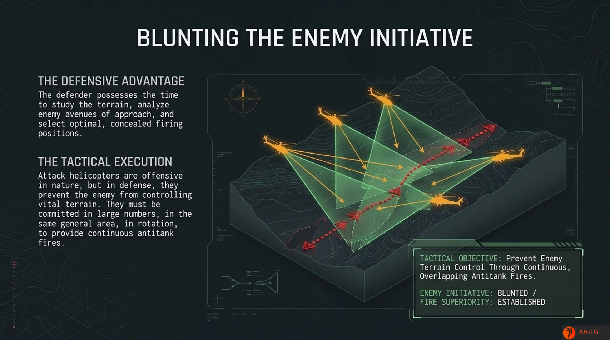

### Covering Force Area (CFA) Operations

Operations within the Covering Force Area (CFA) disrupt advancing enemy lead elements before they reach the Main Battle Area (MBA). CFA operations rely on three foundational execution pillars:

* **Integration:** Attack helicopters operate in tandem with ground cavalry.
* **Patience:** Units wait until the enemy situation is fully developed and major thrusts are explicitly identified.
* **Commitment:** Rapidly committed to the most threatened sectors to destroy massed enemy tanks via indirect, covered movement.

### Main Battle Area (MBA) Penetration Counter-Attacks: The Ultimate Reserve

When enemy armored forces breach the Forward Edge of the Battle Area (FEBA), attack helicopters operate as "The Ultimate Reserve" under forward brigade operational control (OPCON) or tactical control (TACON).

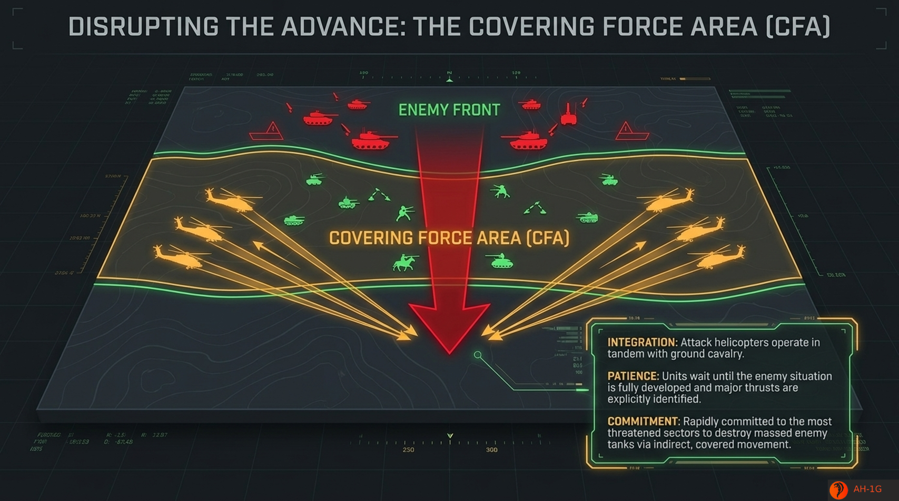

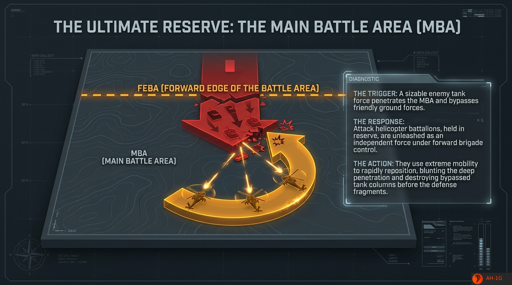

* **The Trigger:** A sizable enemy tank force penetrates the MBA and bypasses friendly ground forces across the FEBA.
* **The Response:** Attack helicopter battalions, held in reserve, are unleashed as an independent force under forward brigade control.
* **The Action:** They use extreme mobility to rapidly reposition, blunting the deep penetration and destroying bypassed tank columns before the defense fragments.

Executing both offensive and defensive missions continuously requires a rigid logistical force rotation framework to prevent operational culmination.

---

## 6\. Sustaining Combat Operations: The One-Third Rotation Rule

### Context &amp; Strategic Importance

Continuous anti-tank fire superiority requires strict force management logistics. Without a structured rotation framework, attack units risk simultaneous fuel and ordnance depletion, creating operational lulls that allow the enemy to regroup or break contact. Implementing the One-Third Rotation Rule guarantees unbroken engagement area coverage and continuous anti-armor pressure.

### Mechanics of the One-Third Rule

To maintain continuous antitank fire on the enemy without culmination, units rotate strictly by thirds across a continuous operational cycle:

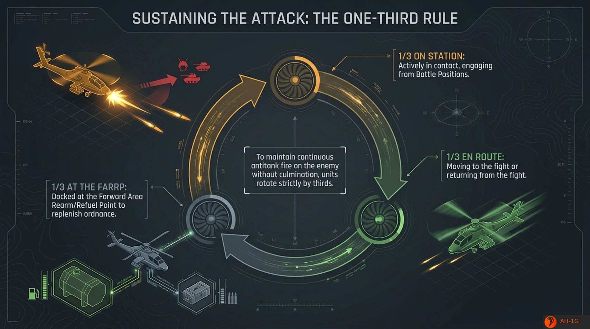

* **1/3 On Station:** Actively in contact, engaging from Battle Positions.
* **1/3 En Route:** Moving to the fight or returning from the fight along covered tactical movement corridors.
* **1/3 At the FARRP:** Docked at the Forward Area Rearm/Refuel Point to replenish ordnance and fuel.

### FARRP Integration &amp; Continuous Pressure Dynamics

Strict adherence to the One-Third cycle integrates forward logistics directly into tactical battle management. As the "On Station" element approaches fuel limits or ordnance exhaustion, the "En Route" element arrives to assume engagement coverage, occupying designated primary battle positions without operational interruption. Simultaneously, the relieved element transits to the FARRP, re-arms, re-fuels, and enters the maintenance and staging queue. This continuous loop deprives threat commanders of operational lulls, subjecting advancing or retreating armor to unrelenting anti-tank fires until enemy operational capability is fully degraded.

---

## Final Executive Checklist for Aviation Commanders

Commanders, staff officers, and flight leaders must enforce the following summary directives across all rotary-wing combat operations:

* [ ] **Enforce Terrain Masking:** Mandate Nap-of-the-Earth (NOE) and contour flight profiles during all tactical transit. Treat the earth as primary armor and maintain 50 ft AGL masked profiles.
* [ ] **Decouple Scouting from Strike:** Never commit attack platforms to un-scouted engagement areas. Ensure Aeroscouts ("The Hound") locate targets and verify BPs before committing Attack Helicopters ("The Hunter").
* [ ] **Optimize Standoff Engagements:** Engage targets at maximum standoff ranges (up to 4.2 km) and limit full unmasking windows (150 ft AGL) to short duration pop-ups to deny threat radar tracking loops.
* [ ] **Engage Valid Target Profiles:** Focus anti-armor fires exclusively on moving armor formations and high-value target hierarchy tiers. Never divert attack helicopters to engage static, dug-in infantry positions.
* [ ] **Enforce the One-Third Rotation Rule:** Structure operational commitments strictly by thirds (1/3 On Station, 1/3 En Route, 1/3 at the FARRP) to guarantee unbroken antitank fires without unit culmination.
* [ ] **Bypass Rear Guards in Pursuit:** Ensure encircling forces in Phase III bypass threat rear guards to strike retreating main bodies directly, sealing off retreat corridors via wide sweeping arcs.
* [ ] **Integrate Ground-Air Capabilities in Defense:** Maintain close operational integration with ground cavalry in the CFA, and preserve attack helicopter battalions as a mobile reserve for rapid commitment against MBA penetrations.

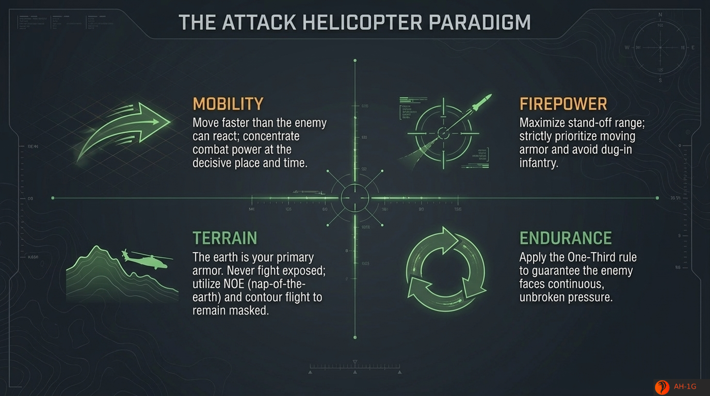

