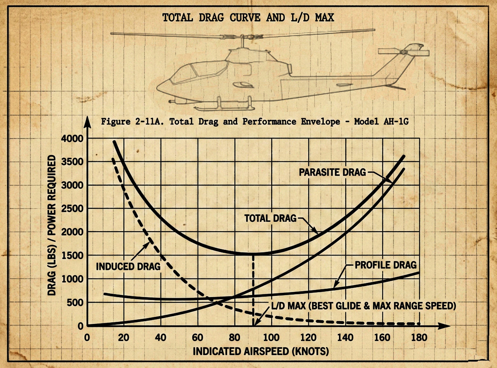
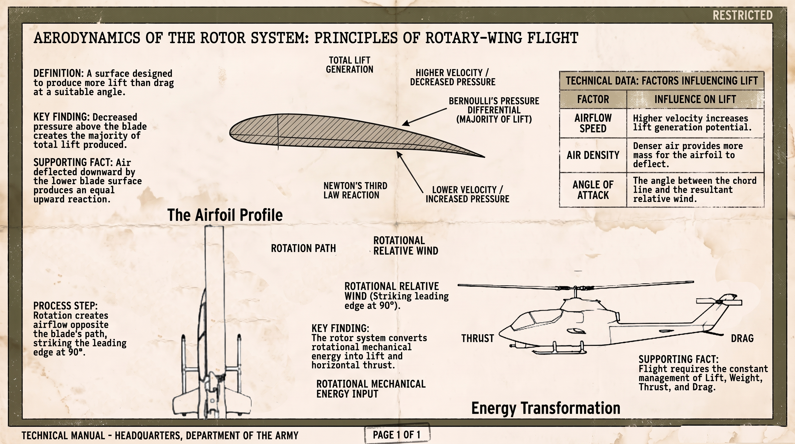
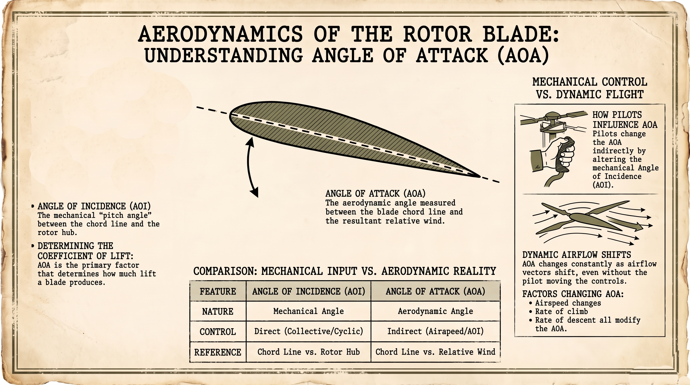
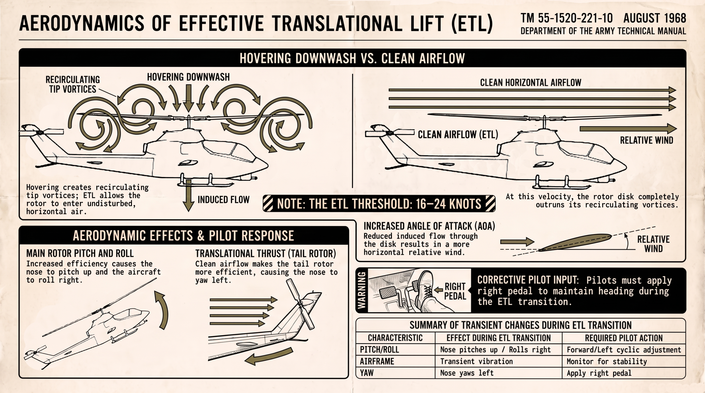
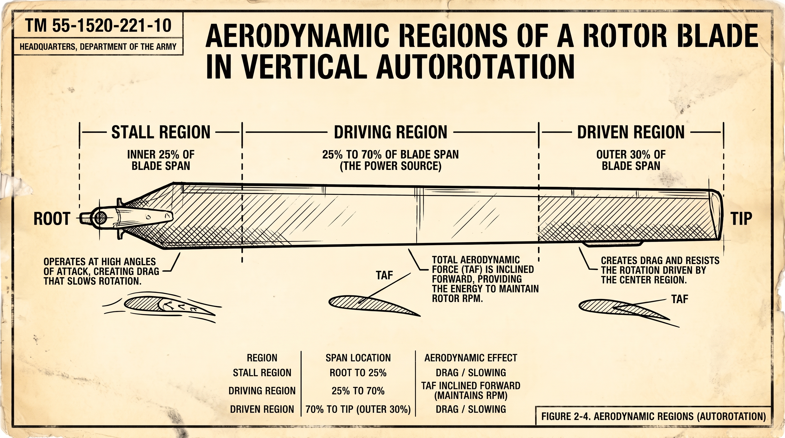
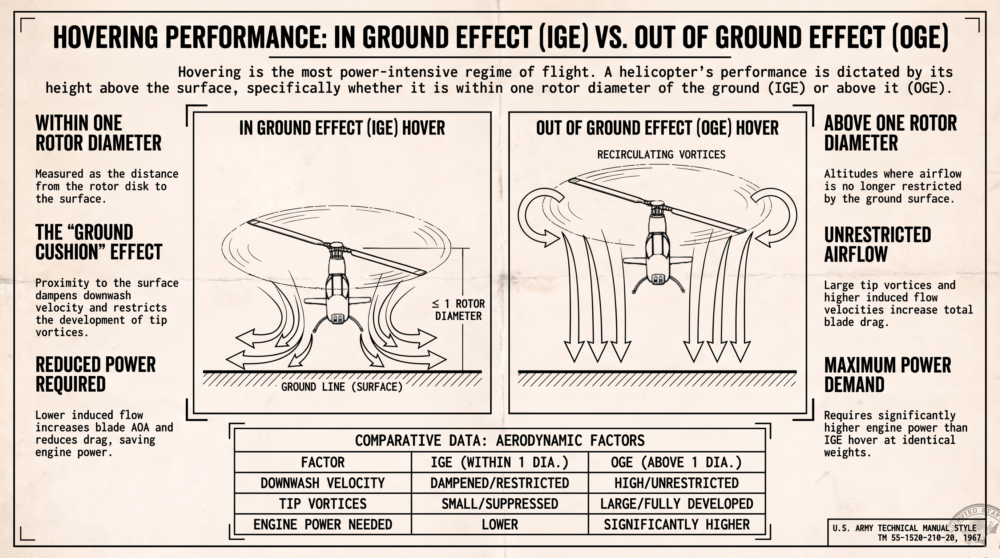
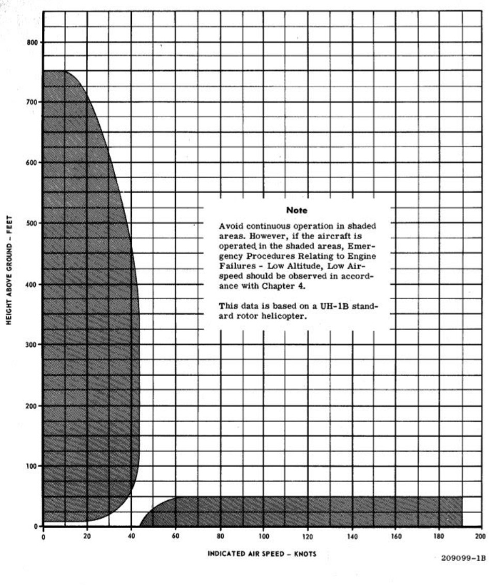

# Helicopter Flight Theory: A Technical Guide for Flight Simulator Enthusiasts

## 1. Fundamental Forces of Flight in Rotary-Wing Aviation

Understanding rotary-wing aerodynamics requires shifting from the static force models of fixed-wing aviation to a framework governed by continuous dynamic forces. Unlike a fixed-wing aircraft, which relies on forward airframe velocity to move air over its wings, a helicopter generates relative airflow mechanically through the high-speed rotation of its main rotor blades. This unique mechanical arrangement means that aerodynamic forces are constantly changing across the rotor disk during flight. For virtual pilots and flight simulator enthusiasts, mastering these interacting forces is essential for executing precise hovering, maintaining trim during forward transitions, and avoiding hazardous flight regimes.

During flight, every maneuver performed by a helicopter is governed by the equilibrium or imbalance of four fundamental forces: Lift, Weight, Thrust, and Drag.

.png>)

### Lift

Lift is the aerodynamic force generated perpendicular to the flightpath (or resultant relative wind) through the center of lift, opposing the downward pull of weight. In a rotary-wing aircraft, lift is generated by moving airfoils (rotor blades) through the air. The total lift produced depends on the speed of the relative airflow, air density, rotor blade surface area, and the angle of attack (AOA) between the air and the airfoil chord line.

### Weight

Weight is the combined gravitational force acting downward on the mass of the helicopter, its crew, fuel, and payload, acting vertically through the aircraft’s center of gravity (CG). In addition to static gross weight, a helicopter experiences dynamic load factors—or "G" loads—during maneuvering flight, such as banked turns, pullouts from dives, or flight through severe atmospheric turbulence.

When a helicopter is banked while maintaining a constant altitude, the total load supported by the rotor blades increases exponentially:

* At bank angles up to 30 degrees, the apparent weight increase is relatively small (a 16% load factor increase, or 1.16 Gs).
* At a 60 degrees bank angle, the load factor doubles to 2.0 Gs. An 8,000-pound helicopter requires its rotor disk to produce 16,000 pounds of total lift to maintain altitude.
* At an 80 degree bank angle, the load factor increases to nearly six times the aircraft's weight (6.0 Gs or 48,000 pounds of required lift).

This load is distributed across the main rotor system. In a two-bladed rotor system, like the Cobra, each blade supports 50% of the total load, whereas in a three-bladed system, like the Gazelle, each blade supports 33.3%. Exceeding available engine power or available blade pitch during high-G bank angles results in an inability to maintain altitude or airspeed, potentially leading to aerodynamic overloading.

### Thrust

Thrust is the dynamic force produced by the engine and rotor system that overcomes aerodynamic drag. While thrust acts parallel to the longitudinal axis in conventional airplanes, a helicopter’s main rotor disk can tilt in any direction via cyclic input. Tilting the tip-path plane tilts the total lift/thrust vector, allowing the aircraft to move horizontally (forward, rearward, or sideward) or hold position against wind. Additionally, the tail rotor produces variable horizontal thrust controlled via antitorque pedals to neutralize main rotor torque and manage yaw.

### Total Drag

Drag is the retarding force acting parallel and opposite to the direction of relative airflow. Total drag acting on a helicopter is composed of three distinct aerodynamic sources, detailed in the table below:

| Drag Component |	Physical Origin & Aerodynamic Cause	| Behavior Relative to Airspeed |
|----------------|--------------------------------------|-------------------------------|
 Profile Drag |Form drag (turbulent wake separation caused by blade structure) and skin friction (microscopic surface roughness eddies) on rotating rotor blades. |Remains relatively constant at low speeds, increasing moderately at high airspeeds.
Induced Drag |Generated by pressure equalization between lower high-pressure and upper low-pressure surfaces at blade tips, creating trailing vortices and downwash.|Highest in a hover and at low airspeeds (high AOA); decreases as forward airspeed increases and AOA is reduced.
Parasite Drag|Resistance from non-lifting airframe components (fuselage, cabin, rotor hub, landing gear, cowlings).	|Zero in a zero-wind hover; increases exponentially with the square of velocity (V^2), quadrupling every time airspeed doubles.

Total Drag Curve and L/D MAX

Plotting profile, induced, and parasite drag against indicated airspeed yields the total drag curve. At low speeds, induced drag dominates; at high speeds, parasite drag dominates.

The lowest point on the total drag curve represents the airspeed where total drag is minimized. This point provides the maximum lift-to-drag ratio (L/D MAX). Flying at L/D MAX offers the most favorable balance of lift capacity versus total drag, establishing the optimal baseline airspeed for aircraft efficiency, climb performance, and glide distance.

With total dynamic forces balanced in unaccelerated flight, mastering precise control requires diving beneath macro force vectors to examine the microscopic fluid mechanics and pressure differentials generated across individual airfoils.

## 2. Airfoil Aerodynamics and Rotor System Physics

To understand how a helicopter flies, virtual pilots must examine the fluid dynamics surrounding individual rotor blades. Rotor blades are airfoils designed to create an aerodynamic pressure differential as they move through the air. By manipulating the velocity and direction of relative airflow, the rotor system transforms rotational mechanical energy into lift and horizontal thrust.

### Bernoulli’s Principle & Pressure Differentials

Bernoulli’s Principle of fluid dynamics derives from the law of conservation of energy (P_Total = P_Dynamic + P_Static). In a closed fluid system or a constricted venturi flow, total pressure remains constant. When fluid velocity increases, dynamic pressure increases, causing a corresponding decrease in static pressure.

As air strikes the leading edge of an airfoil, the upper curved camber accelerates the airflow over the top of the blade. This local velocity increase creates high dynamic pressure and reduced static pressure along the upper surface. Conversely, air passing along the flatter lower surface moves relatively slower, maintaining a higher static pressure. This differential in static pressure between the lower and upper surfaces produces the primary upward lift force.

### Newton’s Third Law of Motion

Newton’s Third Law ("for every action, there is an equal and opposite reaction") provides a secondary contribution to lift. Air striking the angled lower surface of the rotor blade is deflected downward (downwash). The physical action of displacing air downward generates an equal and opposite upward lifting reaction on the airfoil, similar to the planing effect of water skis.

Newton’s Third Law also governs airframe rotational dynamics: as the engine turns the main rotor disk in a counterclockwise direction, the helicopter airframe attempts to rotate in the opposite (clockwise) direction. This reactive turning force is known as main rotor torque.

### Airfoil Design: Symmetrical vs. Nonsymmetrical

Helicopters utilize either symmetrical or nonsymmetrical (cambered) rotor blade profiles, depending on performance requirements:

* Symmetrical Airfoils: Possess identical upper and lower surface curvatures, causing the mean camber line to coincide directly with the chord line. A symmetrical airfoil generates zero lift at a zero angle of attack (\text{AOA}). It maintains a stable center of pressure throughout pitch changes, preventing severe twisting forces (torsional loads) on the blade structure. Light helicopters often use symmetrical airfoils due to their stability and lower manufacturing costs.
* Nonsymmetrical (Cambered) Airfoils: Feature greater curvature on the upper surface than the lower surface, creating a distinct mean camber line above the chord line. Nonsymmetrical airfoils produce useful lift at a zero \text{AOA}, possess an improved lift-to-drag ratio, and exhibit better stall characteristics. However, they experience center of pressure travel along the chord line of up to 20\%, generating torsional torque loads on the blade structure and increasing production complexity.

### Mechanical Blade Twist

Because a rotor blade rotates around a central mast, the linear rotational velocity varies along its span. The velocity is lowest near the root and reaches its maximum at the blade tip. If a blade were manufactured with a uniform pitch angle along its entire length, the tip would generate excessive lift compared to the root, resulting in severe bending stress and structural fatigue.

To resolve this issue, blades are manufactured with mechanical blade twist. Blade twist provides higher pitch angles at the root (where velocity is low) and lower pitch angles near the tip (where velocity is high). This distributes aerodynamic loading more evenly along the blade span and relieves internal structural stress.

### Pitch Angles: Angle of Incidence vs. Angle of Attack

Virtual pilots must differentiate between mechanical angles set by control linkages and aerodynamic angles resulting from relative airflow:

* Angle of Incidence (AOI): The mechanical pitch angle between the rotor blade chord line and the main rotor hub or tip-path plane. AOI is directly commanded by pilot inputs through collective and cyclic pitch controls.
* Angle of Attack (AOA): The aerodynamic angle measured between the blade chord line and the resultant relative wind. AOA directly determines the coefficient of lift (CL). While pilots influence AOA by altering AOI, AOA changes dynamically during flight as airflow vectors shift, even without mechanical control movement.

### Airflow Vectors in the Rotor System

The resultant relative wind acting on a blade is formed by three primary velocity vectors:

* Rotational Relative Wind: Produced purely by the rotation of the blades about the mast. It flows parallel to the plane of rotation and opposite to the physical path of the airfoil, reaching maximum speed at the blade tips and zero at the mast center.
* Induced Flow (Downwash): As rotor blades produce lift, they draw large masses of air downward through the rotor disk, adding a downward vertical velocity component to the relative airflow.
* Resultant Relative Wind: The velocity vector created by combining rotational relative wind, induced flow, and aircraft translational airspeed. The resultant relative wind serves as the exact reference plane for calculating \text{AOA}, lift, drag, and Total Aerodynamic Force (\text{TAF}) vectors.

Connecting these aerodynamic angles to mechanical flight controls allows pilots to directly adjust blade incidence angles, altering airflow vectors to manage helicopter performance.

## 3. Flight Control Systems & Mechanical Dynamics

Operating a helicopter requires constant, coordinated inputs across four primary flight controls. Because adjustments to one control induce secondary aerodynamic effects that impact the others, virtual pilots must understand the mechanical linkages and gyroscopic dynamics that convert cockpit control inputs into rotor disk reactions.

### Primary Flight Controls

### Collective Pitch Control

Located on the left side of the pilot’s seat, the collective lever changes the angle of incidence (AOI) of all main rotor blades simultaneously and equally, regardless of their rotational position. Raising the collective increases pitch angles across the entire disk, producing a simultaneous increase in lift and drag.

To maintain constant rotor RPM against increased aerodynamic drag, engine power must increase proportionally. Lowering the collective decreases pitch angles and drag, causing rotor RPM to accelerate unless power is reduced.

### Throttle & Governor/Correlator Systems

Helicopter rotor disks are designed to operate within a narrow, optimized rotational speed (RPM) envelope.

* Governors: Electronic or mechanical sensing devices that monitor engine and rotor RPM, automatically adjusting fuel metering to keep RPM constant without pilot intervention. Turbine helicopters and modern piston trainers utilize governor automation.
* Correlators: Mechanical linkages connecting the collective lever directly to the engine throttle. As the collective is raised, the correlator opens the throttle automatically; as it is lowered, it closes the throttle.
* Manual Twist-Grip Throttle: Mounted on the collective lever head, the twist-grip allows manual fine-tuning of engine RPM (rotating counterclockwise/away increases RPM; rotating clockwise/towards decreases RPM). On non-governed piston aircraft, collective is the primary control for manifold pressure, while throttle is the primary control for RPM.

### Cyclic Pitch Control & Gyroscopic Precession

Located between the pilot's legs, the cyclic stick controls the direction of horizontal travel by tilting the main rotor disk tip-path plane relative to the horizon. Moving the cyclic tilts the rotor disk in the corresponding direction (e.g., forward cyclic tilts the disk forward, directing thrust rearward to propel the aircraft forward). The cyclic accomplishes disk tilting via cyclic feathering—varying the pitch angle of each individual blade differentially as it completes a 360 degree cycle of rotation.

Because the spinning rotor disk acts as a gyroscope, it exhibits Gyroscopic Precession: an applied force on a spinning object manifests its maximum deflection approximately 90^\circ later in the direction of rotation.

To precisely orient control inputs, the rotor disk azimuth is mapped using standard clock positions relative to the aircraft airframe:

* 12 o'clock (0 degrees Azimuth): Over the nose of the helicopter.
* 3 o'clock (90 degrees Azimuth): Over the right side (advancing blade region in counterclockwise rotation).
* 6 o'clock (180 degrees Azimuth): Over the tail boom of the helicopter.
* 9 o'clock (270 degrees Azimuth): Over the left side (retreating blade region in counterclockwise rotation).

.png>)

To account for this 90 degree phase lag, mechanical control linkages from the swash plate are rigged with a 90 degree offset. When a pilot pushes the cyclic stick forward:

1. Swash plate mechanical linkages decrease blade pitch angle (AOI) on the right side at 3 o'clock (90 degree azimuth) and increase pitch angle (AOI) on the left side at 9 o'clock (270 degree azimuth).
2. As the blade passing 3 o'clock experiences minimum pitch, gyroscopic precession delays maximum aerodynamic response by 90 degrees. Consequently, maximum downward blade flapping occurs over the nose at 12 o'clock (0 degrees azimuth).
3. Simultaneously, the blade passing 9 o'clock experiences maximum pitch; gyroscopic precession delays maximum response by 90 degrees, causing maximum upward blade flapping to occur over the tail at 6 o'clock (180 degrees azimuth).
4. The combination of maximum downward flapping at 12 o'clock and maximum upward flapping at 6 o'clock smoothly tilts the entire tip-path plane forward.

### Antitorque Pedals

Positioned at the pilot’s feet, antitorque pedals manage aircraft yaw and heading by adjusting the pitch angle and thrust of the tail rotor. Applying the left pedal increases tail rotor pitch, producing higher horizontal thrust that pulls the tail right and yaws the nose left. Applying the right pedal decreases tail rotor pitch, allowing main rotor torque to swing the tail left and yaw the nose right.

In cruise flight, antitorque pedals trim the airframe longitudinally to maintain coordinated, low-drag flight. In autorotation, negative or low positive tail rotor pitch angles are utilized to overcome transmission drag.

### Flight Simulator Hardware Considerations & Control Dynamics

Virtual pilots operating desktop simulation hardware encounter physical differences compared to actual aircraft controls. Desktop joysticks typically feature internal centering springs that exert continuous force toward neutral, whereas real helicopter cyclic controls are un-centered and move freely within a friction-adjusted field (or utilize force-trim release systems).

When flying simulators without force-feedback hardware:

* Translating Tendency Compensation: Virtual pilots must maintain persistent left-lateral pressure on spring-loaded joysticks during hover to counteract rightward drift, rather than trimming the cyclic in position.
* Control Deadzones: Anti-torque pedal deadzones in simulation software must be minimized to prevent non-linear yaw responses during fine hovering adjustments.
* Collective Friction Settings: Setting high virtual friction on throttle/collective hardware prevents unintentional collective displacement during rapid lateral cyclic movements.

### Secondary Hovering Phenomena

### Translating Tendency (Drift)

Single main rotor helicopters with counterclockwise rotation tend to drift laterally to the right while hovering due to the rightward thrust exerted by the tail rotor.

Engineers and pilots neutralize translating tendency using specific design features and control techniques:

* Mounting the main transmission and mast with a slight leftward tilt.
* Rigging cyclic control linkages so the tip-path plane tilts slightly left when the stick is centered.
* Designing the airframe to hover "left skid low".
* Raising tail rotors on pylons closer to the horizontal plane of main rotor torque to eliminate body lean.

### Pendular Action

Because a helicopter fuselage is suspended from a single point (the rotor hub mast), it acts as a pendulum beneath the rotor disk. Abrupt or over-controlled cyclic inputs cause the heavy fuselage to oscillate back and forth, leading to pilot-induced oscillations. Smooth, measured control inputs prevent pendular instability and maintain precise airframe trim.

Manipulating these mechanical controls allows pilots to manage complex, non-symmetric aerodynamic states in forward flight.

4. Crucial Aerodynamic Phenomena in Rotary-Wing Flight

As a helicopter transitions from a stationary hover into directional flight, the rotor system encounters complex airflow dynamics. Flight simulator enthusiasts must recognize these aerodynamic states to anticipate control responses, avoid loss of control, and handle emergency procedures.

### Dissymmetry of Lift

Dissymmetry of lift is the unequal lift generated across opposite sides of the main rotor disk during forward flight. It is caused by differences in relative wind velocity between the advancing half and retreating half of the rotor disk.

Uncorrected, a counterclockwise main rotor disk would produce excessive lift on the advancing (right) side and diminished lift on the retreating (left) side, causing the helicopter to roll uncontrollably to the left.

To equalize lift across the disk automatically, helicopters rely on blade Flapping and cyclic feathering:

* As the advancing blade speeds up, its increased lift causes it to flap upward. Up-flapping introduces a downward vertical velocity vector, increasing induced flow, reducing AOA, and decreasing lift.
* As the retreating blade slows down, it loses lift and flaps downward. Down-flapping introduces an upward vertical velocity vector, decreasing induced flow, increasing AOA, and increasing lift.

### Blowback & VNE Limits

As forward airspeed increases, the combined effects of flapping and transverse flow cause the rotor disk to pitch up and roll right—a phenomenon known as blowback. Pilots must apply continuous forward cyclic pressure to hold the rotor disk at the desired attitude.

If forward airspeed is pushed beyond the aircraft's Never-Exceed speed (VNE), the retreating blade reaches a critical high AOA while operating in low relative wind, resulting in Retreating Blade Stall. Retreating blade stall causes a violent pitch-up of the nose, severe vibration, and a pronounced roll toward the retreating side (left side on counterclockwise systems).

### Translational Lift & Effective Translational Lift (ETL)

Any horizontal airflow across the rotor disk—whether caused by aircraft forward movement or ambient headwind—improves rotor efficiency, a benefit known as translational lift.

Between 16 and 24 knots, the rotor disk transitions into Effective Translational Lift (ETL). At this velocity, the disk completely outruns its own recirculating tip vortices and enters clean, undisturbed air:

* Induced flow through the disk decreases rapidly.
* The resultant relative wind becomes more horizontal, increasing AOA.
* Rotor efficiency increases, causing the nose to pitch up and the aircraft to roll right, accompanied by a distinct transient aerodynamic vibration.
* Translational Thrust: The tail rotor also encounters clean airflow, becoming more efficient. Increased tail rotor thrust causes the nose to yaw left, requiring the pilot to apply right pedal to maintain heading.

### Transverse Flow Effect

Occurring between 12 and 15 knots (the primary onset threshold immediately preceding ETL at 16–24 knots), transverse flow effect is caused by an unequal downwash distribution between the front and rear portions of the rotor disk:

* Forward Disk Area: Meets fresh, undisturbed air, experiencing less induced flow and a higher AOA, generating greater lift and causing blades to flap up.
* Aft Disk Area: Operates in air that has already been accelerated downward by the forward disk, experiencing increased induced flow and a lower AOA, generating less lift and causing blades to flap down.

Due to gyroscopic precession (90 degrees phase lag), the maximum upward deflection of the fore-and-aft lift differential manifests on the right side of the aircraft. Transverse flow effect initiates between 12–15 knots as a distinct low-frequency vibration and rightward rolling tendency. As acceleration continues, peak roll displacement stabilizes around 20 knots, requiring left lateral cyclic correction to maintain level flight.

### Autorotation Mechanics & Instrument Scan Directives

Autorotation is an unpowered flight condition where the main rotor disk is driven by the upward flow of relative air during descent, rather than by engine power. In an engine failure, a freewheeling unit (sprag clutch) automatically disengages the engine from the transmission, allowing the main rotor to spin freely.

Virtual pilots simulating engine failures must execute an immediate instrument scan directive: monitoring the dual tachometer display for a "split needle" condition. During powered flight, the engine speed needle (NP or N1) and rotor speed needle (NR) are superimposed. Upon engine failure, the engine needle drops to zero while the rotor needle remains in the green arc. Recognizing needle separation confirms that the sprag clutch has successfully disengaged, permitting safe autorotative descent.

In a steady vertical autorotative descent, the span of each rotor blade is divided into three distinct aerodynamic regions:

In forward autorotation, these blade regions shift outboard toward the retreating blade side due to asymmetric airflow. Equilibrium is maintained by adjusting collective pitch to balance accelerating forces in the driving region against decelerating forces in the driven and stall regions.

Understanding these dynamic aerodynamic states directly informs how pilots evaluate overall aircraft performance limits and operational safety boundaries.

## 5. Helicopter Performance, Density Altitude, and Operational Boundaries

Helicopter capabilities vary based on aircraft weight, atmospheric density, and proximity to the ground. Virtual pilots must evaluate environmental factors and weight limits to operate safely within certified envelope boundaries.

### Ground Effect Dynamics: IGE vs. OGE Hovering

Hovering demands more engine power than any other flight regime. Hover performance changes based on proximity to the surface:

* In Ground Effect (IGE) Hover: Occurs when hovering within approximately one rotor diameter height of the ground (measured from disk to surface). The proximity of the ground restricts the physical development of tip vortices and dampens downward downwash velocity. Induced flow decreases, allowing relative wind to remain more horizontal. This increases blade \text{AOA}, reduces induced drag, and lowers the engine power required to hover. Maximum ground effect is achieved over smooth, hard surfaces.
* Out of Ground Effect (OGE) Hover: Occurs above one rotor diameter height. Airflow downwash is unrestricted, generating higher induced flow velocities and large tip vortices. This reduces blade \text{AOA}, requiring higher blade pitch angles and generating increased drag. Consequently, hovering OGE requires significantly higher engine power than hovering IGE under identical gross weights and atmospheric conditions.

### Density Altitude & Gross Weight Constraints

Air density directly impacts both engine power output and rotor blade lift generation. Density altitude—pressure altitude corrected for non-standard temperature and humidity—acts as the primary metric for aircraft performance:

* High Temperature, High Pressure Altitude, & High Humidity: Reduce air density, drastically degrading engine horsepower output and rotor efficiency.
* Gross Weight Adjustments: Higher gross weight increases required rotor thrust, demanding higher pitch angles, creating more drag, and increasing engine torque. Increased torque requires additional antitorque tail rotor power, further depleting power available for main rotor lift.

If density altitude increases or gross weight is too high, a point is reached where power required exceeds power available, lowering both IGE and OGE hover ceilings.

### Height/Velocity (H/V) Diagram ("Dead Man's Curve")

The Height/Velocity (\text{H/V}) diagram outlines combinations of height above ground and indicated airspeed that must be avoided during flight. The chart defines flight parameters from which a safe autorotative landing cannot be guaranteed in the event of an engine failure.

The H/V diagram features two primary shaded avoid areas:

* High Altitude / Low Airspeed Avoid Area (High Hover): If an engine fails while hovering at 200 feet with zero airspeed, the pilot lacks sufficient altitude and time to lower the collective, convert height into forward velocity, and establish a stable autorotative glide speed before ground impact.
* Low Altitude / High Airspeed Avoid Area: Flying close to the ground at high airspeeds leaves insufficient reaction time for a pilot to flare, convert kinetic airspeed into altitude/rotor RPM, and cushion the landing before a high-speed collision occurs.

To navigate safely around these hazardous envelopes, pilots execute a standardized takeoff profile: initiating forward flight at a low skid height (2–3 feet), accelerating through translational lift near the surface, and climbing only after reaching a safe autorotative airspeed.

### Operational Conclusion

By mastering the aerodynamic principles detailed throughout this guide—from macro force balances to microscopic fluid dynamics, gyroscopic precession phase lag, ETL transitions, and density altitude calculations—flight simulator enthusiasts elevate their virtual airmanship. Translating theoretical aerodynamic physics into precise cockpit control adjustments enables simulation pilots to achieve unparalleled precision, realistic aircraft handling, and flawless operational execution across all rotary-wing maneuvers.

