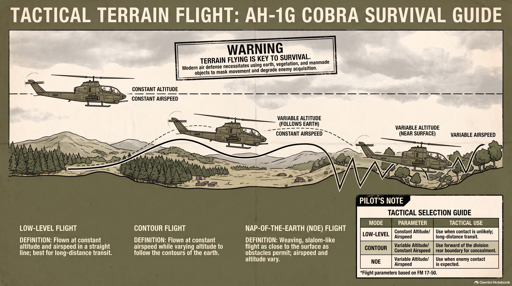
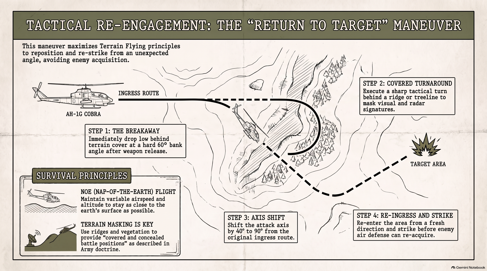

# AH-1 COBRA FLIGHT MANEUVER GUIDE
## A Step-by-Step Tactical & Flight Manual for Simulator Pilots
Welcome to the official tactical flight maneuver guide for the Bell AH-1 Cobra attack helicopter. This guide is designed
for flight simulator pilots who want realistic flight techniques, step-by-step procedures, and exact technical operational numbers. Every maneuver in this manual is drawn directly from US Army technical manuals (TM 55-1520-221-10, TM
55-1520-234-10) and tactical doctrine (FM 17-50). Mastering these normal, emergency, and combat maneuvers will allow you to fly, survive, and dominate the battleground.

## SECTION 1: CORE FLIGHT FUNDAMENTALS & LIMITS
Before taking off, every Cobra pilot must know the key gauge limits and aerodynamic principles. The AH-1 Cobra uses a two-bladed teetering rotor system driven by a Lycoming T53 turboshaft engine. Unlike fixed-wing aircraft, power and rotor speed management require continuous attention.

|System/Gauge|Normal Range|Maximum / Caution Limit|Notes & Pilot Action|
|-----------|------------|-----------------------|---------------------|
|Engine RPM (N2) |6,400 - 6,600 RPM|6,600 RPM Max|Low RPM audio warning sounds at 6,000 ±100 RPM.|
|Rotor RPM (NR) |294 - 324 RPM| 324 RPM Max| Audio warning light/horn activates below 295 ±5 RPM.|
|Gas Producer (N1)| 70 - 72% (Idle)| 101.5% Continuous| Indicates gas generator speed.Topping check verifies power.|
|Turbine Gas Temp (TGT)| 400°C - 625°C| 760°C (Start Max) 30-min limit is 625°C-645°C. |Hot start if >675°C for >5s.|
|Torque Pressure| 0 - 50 PSI| 50 PSI (56 PSIG 30-min)| Transmission limited to 1,100 SHP (50 PSI continuous).
|Airspeed (VNE)| 0 - 140 KIAS| 190 KIAS (Redline)| VNE drops at high altitude or withXM 159 rocket pods.|

### Stability Augmentation System (SCAS)
The Cobra features a 3-axis SCAS (Pitch, Roll, Yaw) that uses hydraulic actuators to dampen atmospheric turbulence and stabilize gun firing. Always verify SCAS channels are ON prior to takeoff, but disengage SCAS in hydraulic failure emergencies.

## SECTION 2: NORMAL FLIGHT MANEUVERS

### 2.1 Hover Check & Hover Taxi

* Step 1: Lift-Off to Hover: Smoothly raise the collective pitch lever while adding left anti-torque pedal to offset main
rotor torque. Establish a steady 3-foot skid height above the ground.
* Step 2: Control Check: Verify cyclic responsiveness in pitch and roll. Check pedal control availability and confirm
engine torque is well within limits (typically 25–35 PSI).
* Step 3: Instrument & Power Sweep: Check engine oil pressure, hydraulic pressure gauges (Systems #1 and #2 at
1,000 PSI), and ensure no caution lights are illuminated.
* Step 4: Hover Taxi: Maintain 3 to 5 feet altitude and groundspeed below 10 knots. Use cyclic to control movement
direction and pedals to keep the nose aligned with the taxi path.

**PRO-TIP FOR SIM PILOTS:**
*When lifting into a hover, apply gentle left pedal immediately as you pull collective. Without left pedal, the Cobra's nose will swing right as engine torque increases.*

### 2.2 Coordinated Max-Performance Takeoff & Climb
* Step 1: Alignment & Power Check: Align aircraft with takeoff direction into the wind. Note hover torque.
* Step 2: Forward Acceleration: Ease cyclic forward to initiate forward momentum. As airspeed reaches 10 to 15
knots, the aircraft passes through Effective Translational Lift (ETL).
* Step 3: ETL Transition: As ETL takes effect, the rotor disk gains increased lift. The nose will pitch up and roll right.
Apply forward cyclic and left pedal to hold your takeoff heading and altitude.
* Step 4: Climb Pitch Attitude: Adjust cyclic to pitch for optimum climb speed (50 to 70 KIAS depending on gross
weight: 55 KIAS at 6,000 lbs; 67 KIAS at 9,500 lbs). Increase collective to maximum continuous torque (50 PSI).
* Step 5: Trim Climb: Use force trim and pedals to center the turn ball. Maintain optimum airspeed until reaching
target cruise altitude.
### 2.3 Level Acceleration Takeoff (Confined Area Departure)
* Step 1: Position Check: Position aircraft at the rearmost edge of the clearing facing wind and obstacles.
* Step 2: Low-Level Acceleration: Apply forward cyclic while increasing collective to stay between 2 and 5 feet skid
height. Keep aircraft level while accelerating smoothly.
* Step 3: Airspeed Build-Up: Allow airspeed to rapidly pass through ETL (10–15 knots) and accelerate to best climb
airspeed (50–60 knots) while remaining low to clear trees.
* Step 4: Obstacle Pull-Up: Upon reaching climb airspeed, smoothly apply aft cyclic and pull maximum allowed
torque (up to 56 PSIG for 30 minutes) to execute a steep obstacle-clearing climb.
### 2.4 Normal Approach & Power-On Landing
* Step 1: Approach Entry: Establish a steady glide path on a final approach angle of 8° to 10° at 60 to 70 KIAS.
* Step 2: Deceleration: At approximately 100 feet above ground level (AGL), smoothly ease cyclic back to reduce
forward airspeed while adjusting collective to control sink rate.
* Step 3: Rate of Sink Control: Keep rate of descent below 500 feet per minute (fpm) to prevent settling with power.
* Step 4: Hover Termination: As airspeed drops toward zero, increase collective to cushion touchdown or establish
a 3-foot hover over the landing spot.
* Step 5: Touchdown: Lower collective smoothly until skids rest firmly on the ground. Reduce collective to full down.
### 2.5 Steep Approach & Confined Spot Landing
* Step 1: Entry Profile: Intercept a steep 12° to 15° glideslope over obstacles surrounding the landing zone.
* Step 2: Airspeed & Power Coordination: Reduce forward airspeed earlier than normal (40–50 KIAS). Adjust
collective continuously to maintain precise sightline to the landing spot.
* Step 3: Sink Rate Monitoring: Maintain sink rate under 400 fpm. Excessive sink rate at low airspeed will trigger
vortex ring state (settling with power).
* Step 4: Termination: Terminate to a stationary 3-foot hover directly over the intended landing pad, then smoothly
lower collective to land.
### 2.6 Slope Landing Technique
* Step 1: Heading Setup: Always orient the helicopter cross-slope (heading perpendicular to the hill incline). Never
land upslope or downslope.
* Step 2: Upslope Skid Touchdown: Lower collective slowly until the upslope skid gently makes contact with the
ground.
* Step 3: Cyclic Control Application: As the upslope skid touches, apply lateral cyclic into the slope to hold the
upslope skid firmly in place.
* Step 4: Complete Touchdown: Continue lowering collective slowly while adding lateral cyclic into the slope until
the downslope skid rests on the ground. Once stable, lower collective fully and center controls.

**SLOPE LIMIT WARNING**
*Maximum slope landing limits for the Cobra are 10° cross-slope or 7° nose-up/nose-down. Abort the landing if cyclic control limits are reached before both skids rest firmly on the ground.*
## SECTION 3: EMERGENCY PROCEDURES & RECOVERIES
### 3.1 Engine Failure & Autorotation Entry
* Step 1: Immediate Collective Reduction: Upon engine flameout or power loss (indicated by low RPM horn and
right yaw), lower collective pitch **FULL DOWN** immediately. This is essential to prevent main rotor RPM decay below
295 RPM.
* Step 2: Pedal & Trim Adjustment: Apply right pedal to trim the fuselage (engine torque loss causes left nose yaw).
* Step 3: Airspeed Selection:
    * Maximum Glide Distance (L/D Max): Trim airspeed to 90 - 100 KIAS for shallowest descent angle.
    * Minimum Rate of Descent: Trim airspeed to 55 - 65 KIAS for maximum time in air.
* Step 4: Autorotative Flare (50-70 ft AGL): Smoothly pull aft cyclic to flare the aircraft, reducing forward airspeed
and sink rate while boosting rotor RPM.
* Step 5: Touchdown Cushioning (10-15 ft AGL): Level the skids with cyclic and apply initial collective to check
descent. As skids approach ground, pull full remaining collective to cushion touchdown.
### 3.2 High-Speed Engine Failure Recovery (120-190 KIAS)
* Step 1: Recognize Pitch-Up Moment: Engine failure at high forward speed causes an immediate, strong
aerodynamic pitch-up moment due to rotor disc forces.
* Step 2: Cyclic Control: Prevent extreme pitch-up by applying firm forward cyclic. Simultaneously drop collective full
down.
* Step 3: Prevent Mast Bumping: Avoid abrupt cyclic movements while rotor RPM is decaying to prevent main rotor
mast bumping.
* Step 4: Airspeed Bleed: Allow aircraft to climb slightly while bleeding airspeed down to the 90–100 KIAS glide
speed.
### 3.3 Low-G Recovery & Mast Bumping Avoidance
* Step 1: Recognize Condition: Pushing cyclic forward aggressively or cresting a hill rapidly creates a zero-G or
negative-G state (< 0.5G). In a teetering rotor like the Cobra, the tail rotor thrust will cause the helicopter to roll
violently to the right.

**CRITICAL ERROR TO AVOID:** *NEVER apply left cyclic to correct right roll during Low-G! Doing so causes main
rotor hub flap stops to strike the rotor mast, causing catastrophic mast bumping.*

* Step 2: Immediate Recovery Action: Apply smooth AFT CYCLIC ONLY. This reloads the main rotor disk with
positive G-force.
* Step 3: Wing Leveling: Once positive rotor loading is restored (felt as G-force returning), gently apply lateral cyclic to level wings.

**LIFE-SAVING RULE FOR COBRA PILOTS**

*Low-G + Left Cyclic = Mast Bumping & Structural Failure. ALWAYS apply AFT CYCLIC first to reload the rotor before attempting to roll left!*

### 3.4 Single & Dual Hydraulic Failure Running Landing
* Step 1: Master Caution Response: When HYD PRESS 1 or HYD PRESS 2 light illuminates (pressure drops below
800 PSI), immediately turn off the affected hydraulic switch.
* Step 2: Control Handling: Prepare for high control feedback forces. Maintain forward airspeed at or above 40
KIAS. Below 40 KIAS, unboosted cyclic controls become extremely heavy.
* Step 3: SCAS Disengagement: Turn OFF all SCAS channels (Pitch, Roll, Yaw) and PLT OVRD switch.
* Step 4: Running Landing Execution: Perform a shallow approach to a smooth runway. Land flat at approximately
50 KIAS, letting the skids slide smoothly on the surface while lowering collective.

### 3.5 Loss of Tail Rotor Thrust / Antitorque Malfunction

* Step 1: High Airspeed Recovery: If tail rotor thrust fails in cruise flight, the aircraft will yaw left severely.
Immediately adjust airspeed to 50–80 KIAS. The large vertical fin provides directional stability at forward speed.
* Step 2: Power Management: Reduce collective to minimum required to maintain flight. High power increases
nose-left yaw.
* Step 3: Running Landing vs Autorotation: Execute a powered running landing at 50–60 KIAS, cutting throttle to
OFF right as skids touch down. If yaw is unmanageable, enter full autorotation.

## SECTION 4: COMBAT MANEUVERS & TACTICAL FLIGHT
### 4.1 Terrain Flight Modes (Low-Level, Contour, NOE)
To survive against modern air defense threats (such as ZSU-23-4 radar anti-aircraft guns and SA-7 missiles), Cobra
pilots use terrain features for concealment. Terrain flying is divided into three distinct modes:

|Flight Mode|Altitude Profile|Airspeed Profile|Tactical Application|
|-----------|----------------|----------------|-----------|
|Low-Level Constant| (100-250 ft AGL) |Constant Speed |Used in secure rear areas for rapid transit.|
|Contour |Conforms to terrain (25-100ft)|Constant / Variable| Used when enemy contact is possible.|
|Nap-of-the-Earth (NOE)|As close to earth as possible (< 25 ft)|Variable (Skimming trees)|Used in enemy contact zones; masks radar.|

### 4.2 Masking & Unmasking Techniques
* Step 1: Masked Position: Hover behind a treeline, ridge, or hill with the aircraft completely hidden from enemy line
of sight.
* Step 2: Vertical Unmasking: Smoothly raise collective to hover vertically just high enough for the gunner's sight or
pilot sight to clear the obstacle. Do not expose fuselage unnecessarily.
* Step 3: Target Engagement: Acquire target and launch ordnance (20mm cannon, 2.75-inch rockets, or TOW
missiles). Limit exposure time to less than 10-15 seconds.
* Step 4: Remasking: Lower collective to descend back behind cover.
* Step 5: Lateral Displacement: Move laterally 100 to 200 meters to an alternate firing position before unmasking
again. Never pop up twice in the exact same spot!

### 4.3 Tactical Movement Formations
* **Traveling**: Used when contact is unlikely. All aircraft move at constant speed in formation.
* **Traveling Overwatch**: Used when contact is possible. Lead element moves continuously; trail element
overwatches from behind and above.
* **Bounding Overwatch**: Used when enemy contact is expected. One element establishes a covered battle position
(overwatch) while the second element bounds forward to the next covered position.
### 4.4 Diving Fire Run & High-G Pullout Management
* Step 1: Entry Setup: Establish attack altitude (1,500 - 3,000 ft AGL) and align heading with target.
* Step 2: Dive Entry: Lower collective and push cyclic into a 10° to 20° dive. Expect rate of descent to increase by
~1,000 fpm per 10 knots of speed gain.
* Step 3: Firing Solution: Track target using reflector sight. Fire cannon or 2.75-inch rockets.
* Step 4: High-G Pullout: Smoothly apply aft cyclic and pull collective. Avoid abrupt cyclic yanks to prevent rotor
'mushing' or exceeding the 2.0G bank/pullout limit.
### 4.5 Running Fire & Standoff Engagements
* **Running Fire**: Deliver level cannon or rocket fire while maintaining forward airspeed (60–100 KIAS) at low altitude
(50–100 ft AGL). Keeps aircraft mobile and harder to hit.
* **Rocket Standoff**: Launch rockets from maximum effective standoff range (up to 10,500 meters). 
### 4.6 Return to Target (Tactical Re-Engagement)
Purpose: Used after a diving or running attack pass to re-engage the target while staying protected from
anti-aircraft weapons.

* Step 1: Breakaway: Immediately upon releasing weapons, drop low behind terrain cover and break away at a hard
60° bank angle.
* Step 2: Covered Turnaround: Execute a sharp tactical turn behind a ridge or treeline, masking your movement
from enemy visual and radar acquisition.
* Step 3: Axis Shift: Change attack axis by 40° to 90° from your original ingress route.
* Step 4: Re-Ingress: Re-enter the target area from a fresh, unexpected direction. Unmask and strike before enemy air defense can re-acquire your position.

#### TACTICAL GOLDEN RULE
**Never attack twice along the exact same flight path. Always use 'Return to Target' behind terrain cover to shift your attack axis and surprise the enemy!**