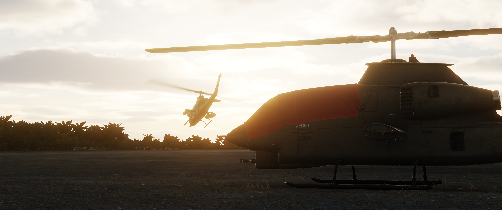

# DCS: AH-1G Cobra Manual
Welcome to the DCS AH-1G Cobra Manual. This document will be your quick reference guide for how to operate the helicopter.

## AH‑1G Cobra — Overview

The AH‑1G Cobra is a Vietnam‑era light attack helicopter developed from the UH‑1 Huey airframe to provide dedicated fire support. It features a slim, tandem cockpit (pilot and gunner) and a single turboshaft powerplant, giving it a smaller frontal profile and improved forward visibility compared with utility helicopters.

Typical roles include close air support, armed escort, and armed reconnaissance. The type is built around a forward‑firing weapons philosophy: a nose‑mounted gun turret supplemented by hardpoints for unguided rockets and guided anti‑armor weapons on later variants.

Key features

* Two‑seat tandem cockpit for pilot and gunner
* Narrow fuselage and reduced frontal area for target survivability
* Forward weapons station with turreted cannon and external stores
* Designed for agility, speed, and precision support in low‑altitude environments

Operational notes

- Entered service during the late 1960s and saw extensive combat in Vietnam
- Optimized for quick reaction fire support but limited by light armor and payload compared with larger attack helicopters
- Influential design that led to numerous follow‑on Cobra variants with upgraded sensors and weapons